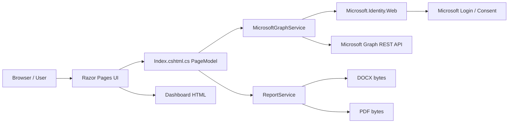
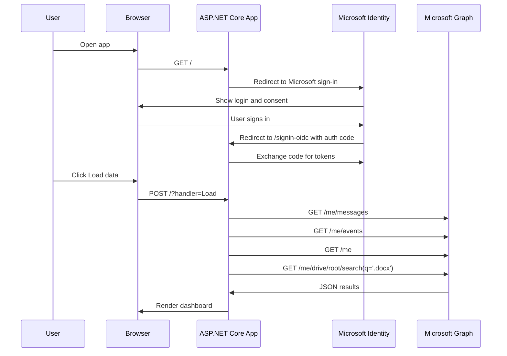

# MicrosoftPilot From-Zero Development Guide

Version: 1.1 Final  
Project type: ASP.NET Core Razor Pages + Microsoft Identity + Microsoft Graph + Azure App Service  
Audience: students with basic C# knowledge who are learning Web Apps, Microsoft Graph, and Azure deployment  

> This textbook-style guide is built around a real, working teaching project. A user signs in with a personal Microsoft account; the app reads Outlook mail, calendar meetings, account profile information, and recently modified Word document metadata from OneDrive; then it exports a DOCX/PDF report. The app does not modify user data, does not store mail content, and does not hard-code the Client Secret in source code.

---

## Table of Contents

1. Project Goal
2. Final Feature List
3. System Architecture Overview
4. Development Environment
5. Creating the Visual Studio Solution from Zero
6. Installing NuGet Packages
7. Azure / Entra App Registration
8. Local Configuration with User Secrets
9. The appsettings.json Configuration File
10. Backend Startup Flow in Program.cs
11. Data Models
12. Microsoft Graph Backend Service
13. Razor Page Backend PageModel
14. Razor Frontend Page
15. Microsoft-Style UI Design
16. DOCX/PDF Report Generation
17. Local Running and Debugging
18. Publishing to Azure Linux Web App
19. Linux-Friendly ZIP Packaging Script
20. Common Errors and Troubleshooting
21. Teaching Recommendations
22. Official References

---

## 1. Project Goal

This project is not a commercial Microsoft 365 administration system. It is a teaching sample for a Web App. Its value is that it connects several concepts students often confuse:

- How ASP.NET Core Razor Pages organize frontend and backend code
- Why Microsoft account sign-in requires an App Registration
- What Client ID and Client Secret mean
- Why Microsoft Graph permissions must be configured in Azure Portal
- Why localhost and Azure App Service require different redirect URIs
- Why secrets must not be hard-coded
- How to convert Microsoft Graph JSON responses into page data
- How to export page data into DOCX/PDF reports
- How to publish to Azure Linux Web App

The project follows one principle:

> All Microsoft Graph operations are read-only. The app only reads data authorized by the signed-in user. It does not create, update, or delete user data.

---

## 2. Final Feature List

The final application contains these features:

| Feature | Data source | Graph permission | Modifies data |
|---|---|---|---|
| Sign in with a personal Microsoft account | Microsoft Identity Platform | openid, profile | No |
| Read today's Outlook mail | `/me/messages` | `Mail.Read` | No |
| Show urgent/high-importance mail | `/me/messages` | `Mail.Read` | No |
| Show all mail from today | `/me/messages` | `Mail.Read` | No |
| Read scheduled meetings | `/me/events` | `Calendars.Read` | No |
| Filter flights, hotels, package reminders, and other non-meeting calendar events | Local C# LINQ | `Calendars.Read` | No |
| Read account profile | `/me` | `User.Read` | No |
| Read recently modified Word document metadata | `/me/drive/root/search(q='.docx')` | `Files.Read` | No |
| Generate DOCX report | Local OpenXML | No extra permission | No |
| Generate PDF report | Local QuestPDF | No extra permission | No |
| Publish to Azure Linux Web App | Azure App Service | No Graph permission | No |

Note: personal Microsoft accounts do not support reading Teams chat lists through Microsoft Graph delegated APIs. Therefore, the final version removes the chat feature to avoid making students think the code is wrong.

---

## 3. System Architecture Overview

### 3.1 Component Relationship



### 3.2 Sign-In and Data Reading Flow



### 3.3 Why a Web App Needs a Client Secret

This project is a server-side Web App. During sign-in, the browser first goes to the Microsoft sign-in page. After successful sign-in, Microsoft sends an authorization code back to the server. The server then exchanges the code for tokens using:

- Client ID
- Client Secret
- Redirect URI
- Authorization Code

The Client Secret proves that the server is controlled by the owner of the App Registration. It does not belong to end users, and individual users do not need a local copy. In a deployed app, the secret belongs only in the server-side environment variables.

---

## 4. Development Environment

Recommended environment:

- Windows 11
- Visual Studio Community 2026
- ASP.NET and web development workload
- Azure and AI development workload
- .NET 10 SDK
- A personal Microsoft account, such as Outlook.com
- An available Azure subscription for publishing the Azure Web App

Check the command-line environment:

```powershell
dotnet --info
```

If the project target framework is `net10.0`, the Azure Web App runtime should also be `.NET 10`.

---

## 5. Creating the Visual Studio Solution from Zero

### 5.1 Create the Project Folder

This project uses:

```powershell
E:\microsoftpilot
```

From zero, you can run:

```powershell
mkdir E:\microsoftpilot
cd E:\microsoftpilot
```

### 5.2 Create a Razor Pages Project with dotnet CLI

```powershell
dotnet new webapp -n MicrosoftPilot -f net10.0
```

If you want project files directly under `E:\microsoftpilot`, use:

```powershell
cd E:\microsoftpilot
dotnet new webapp -n MicrosoftPilot -f net10.0 -o .
```

### 5.3 Create the Solution

```powershell
dotnet new sln -n MicrosoftPilot
dotnet sln add MicrosoftPilot.csproj
```

Visual Studio can also directly open:

```text
E:\microsoftpilot\MicrosoftPilot.csproj
```

Or open the solution:

```text
E:\microsoftpilot\MicrosoftPilot.sln
```

The current project uses `.slnx`, which can also be opened by newer Visual Studio versions.

Teaching note: different Visual Studio versions may generate `.sln` or `.slnx`. This does not affect the application's logic. As long as students can see the `MicrosoftPilot` project in Visual Studio and the project builds, they can continue.

---

## 6. Installing NuGet Packages

The project needs these packages:

```powershell
dotnet add package Microsoft.Identity.Web --version 4.*
dotnet add package Microsoft.Identity.Web.UI --version 4.*
dotnet add package DocumentFormat.OpenXml --version 3.*
dotnet add package QuestPDF --version 2025.*
```

The final core content of `MicrosoftPilot.csproj` is:

```xml
<Project Sdk="Microsoft.NET.Sdk.Web">

  <PropertyGroup>
    <TargetFramework>net10.0</TargetFramework>
    <Nullable>enable</Nullable>
    <ImplicitUsings>enable</ImplicitUsings>
    <UserSecretsId>29d70735-9250-4393-8c2e-be12fcbc965f</UserSecretsId>
  </PropertyGroup>

  <ItemGroup>
    <PackageReference Include="DocumentFormat.OpenXml" Version="3.*" />
    <PackageReference Include="Microsoft.Identity.Web" Version="4.*" />
    <PackageReference Include="Microsoft.Identity.Web.UI" Version="4.*" />
    <PackageReference Include="QuestPDF" Version="2025.*" />
  </ItemGroup>

</Project>
```

Explanation:

- `Microsoft.NET.Sdk.Web` means this is an ASP.NET Core Web project.
- `net10.0` means the project uses .NET 10.
- `Nullable` enables C# nullable reference types, reducing null reference mistakes.
- `ImplicitUsings` automatically imports common namespaces.
- `UserSecretsId` is used to store sensitive local configuration without putting secrets into source code. This value is generated by `dotnet user-secrets init`; each machine and project can have a different value. Students do not need to copy the sample ID from this guide.
- `Microsoft.Identity.Web` wraps OpenID Connect sign-in and token acquisition.
- `Microsoft.Identity.Web.UI` provides sign-in/sign-out routes and UI integration.
- `DocumentFormat.OpenXml` generates DOCX files.
- `QuestPDF` generates PDF files.

---

## 7. Azure / Entra App Registration

### 7.1 Why App Registration Is Required

A common student misconception is: "I am only building a simple Web App. Why do I need to register an app?"

The reason is that Microsoft sign-in and Microsoft Graph need to know which application is requesting user authorization. App Registration creates a trust record:

- What the app is called
- What its Client ID is
- Which account types it supports
- Which redirect URIs users can be sent back to
- Which Microsoft Graph permissions it requests
- Whether it has a server-side secret

Without App Registration, Microsoft Identity Platform does not know where to send the sign-in result and whether the app is allowed to request Graph data.

### 7.2 Create the App Registration

Azure Portal path:

```text
Microsoft Entra ID
App registrations
New registration
```

Recommended settings:

| Item | Setting |
|---|---|
| Name | MicrosoftPilot or the teaching project name |
| Supported account types | Personal Microsoft accounts, or both organizational accounts and personal Microsoft accounts |
| Redirect URI platform | Web |
| Redirect URI local | `https://localhost:5001/signin-oidc` |

Detailed portal steps:

1. Open Azure Portal: `https://portal.azure.com`.
2. Confirm that the account in the top-right corner is the Microsoft account you want to use for development and registration.
3. In the top search box, enter `Microsoft Entra ID`.
4. Click `Microsoft Entra ID` in the search results.
5. On the Entra page, find the `Manage` group in the left menu.
6. Click `App registrations`.
7. Click `New registration` at the top of the page.
8. In `Name`, enter an app name such as `MicrosoftPilot`. The app name does not have to exactly match the Visual Studio project name, but keeping them consistent is easier for teaching and troubleshooting.
9. In `Supported account types`, choose an option that supports personal Microsoft accounts. If the app targets only Outlook.com/Hotmail/Live personal accounts, choose personal Microsoft accounts. If you also want school or work accounts to sign in, choose the option that supports both organizational and personal accounts.
10. In the `Redirect URI` area, select `Web` as the platform.
11. Enter the local callback URL, for example `https://localhost:5001/signin-oidc`.
12. Click `Register`.
13. After registration, the portal opens the app Overview page. Copy `Application (client) ID`; this is the value for `AzureAd:ClientId`.
14. On the same page, you can also see `Directory (tenant) ID`. For this personal-account project, use `TenantId=consumers`; usually you do not need to put this tenant GUID into code.

If your local port is not 5001, configure the actual port. For example:

```text
https://localhost:7123/signin-oidc
```

### 7.3 Online Redirect URI

After publishing to Azure, add the online address to the same App Registration:

```text
https://your-site.azurewebsites.net/signin-oidc
```

Example format:

```text
https://microsoftpilot-xxxxx.australiaeast-01.azurewebsites.net/signin-oidc
```

Important:

> `redirect_uri` must match exactly. Protocol, domain, port, and path must all be the same.

These are all different URIs:

```text
https://localhost:5001/signin-oidc
http://localhost:5001/signin-oidc
https://localhost:5002/signin-oidc
https://localhost:5001/signin-oidc/
```

Detailed steps to add the online redirect URI:

1. In Azure Portal, search for `App registrations`.
2. Open your app, such as `MicrosoftPilot`.
3. In the left menu, click `Authentication`.
4. If there is no Web platform yet, click `Add a platform` and select `Web`.
5. If the Web platform already exists, click `Add URI` in the `Web` section.
6. Enter the online URL: `https://your-site.azurewebsites.net/signin-oidc`.
7. Click `Save` at the top or bottom of the page.
8. After saving, reopen the online website and sign in again.

If you see `invalid_request: redirect_uri is not valid`, do not change the code first. Copy the `redirect_uri=` parameter from the browser address bar, URL-decode it, and compare it character by character with the URI stored in App Registration. Most cases are caused by missing `/signin-oidc`, using `http` instead of `https`, using a different port, or copying the wrong online domain.

### 7.4 Create the Client Secret

Path:

```text
App registrations
Your app
Certificates & secrets
Client secrets
New client secret
```

After creation, Azure shows two values:

| Field | Purpose |
|---|---|
| Secret ID | Azure's internal identifier for this secret. It cannot be used for app sign-in. |
| Value | The actual secret value that must be placed into application configuration. It is shown only once. |

You must copy **Value**, not Secret ID.

Detailed steps:

1. Open the App Registration.
2. In the left menu, click `Certificates & secrets`.
3. Open the `Client secrets` tab.
4. Click `New client secret`.
5. In `Description`, enter a recognizable name such as `local-and-azure-demo`.
6. Choose an expiration time. Teaching projects can use a shorter lifetime; production projects need a secret rotation plan.
7. Click `Add`.
8. The page shows `Value` and `Secret ID`.
9. Copy `Value` immediately. After leaving the page, you usually cannot see the full Value again.
10. Do not put the `Value` into Git, screenshots, textbooks, chat logs, or public documents.

### 7.5 API Permissions

Path:

```text
App registrations
Your app
API permissions
Add a permission
Microsoft Graph
Delegated permissions
```

Add:

```text
User.Read
Mail.Read
Calendars.Read
Files.Read
```

Detailed steps:

1. In Azure Portal, search for `App registrations`.
2. Open your app.
3. In the left menu, click `API permissions`.
4. Click `Add a permission`.
5. In the pop-up panel, choose `Microsoft Graph`.
6. Choose `Delegated permissions`. This project must use delegated permissions because it reads the signed-in user's own data on behalf of that user.
7. Search for `User.Read` and select `User.Read`.
8. Search for `Mail.Read` and select `Mail.Read`.
9. Search for `Calendars.Read` and select `Calendars.Read`.
10. Search for `Files.Read` and select `Files.Read`.
11. Click `Add permissions` at the bottom of the panel.
12. Back on the `API permissions` page, confirm that these four delegated permissions are listed.

Apps for personal Microsoft accounts usually do not need `Grant admin consent`. If you use a school or work tenant, the administrator may restrict user consent and require admin approval. That is a tenant policy issue, not a code error.

Explanation:

- `User.Read` reads basic information about the signed-in user.
- `Mail.Read` reads the user's mailbox.
- `Calendars.Read` reads the user's calendar events.
- `Files.Read` reads the user's OneDrive file metadata.

This project uses delegated permissions because the app reads "the current user's data" on behalf of "the current signed-in user."

Do not use Application permissions. Application permissions are app-only background permissions, usually require administrator consent, and are much broader than needed for this teaching project.

---

## 8. Local Configuration with User Secrets

### 8.1 Why Real Keys Are Not Stored in appsettings.json

`appsettings.json` goes into source code and the published package. A teaching project can share source code, but it must not share secrets.

Therefore:

- `ClientId` can be a placeholder or public sample value.
- `ClientSecret` must not be written into code.
- Local development uses User Secrets.
- Azure production uses App Service Configuration.

### 8.2 Initialize User Secrets

```powershell
cd E:\microsoftpilot
dotnet user-secrets init
```

### 8.3 Set Local Configuration

Replace the values with your own App Registration values:

```powershell
dotnet user-secrets set "AzureAd:TenantId" "consumers"
dotnet user-secrets set "AzureAd:ClientId" "your-client-id"
dotnet user-secrets set "AzureAd:ClientSecret" "your-client-secret-value"
```

Check:

```powershell
dotnet user-secrets list
```

Do not show `ClientSecret` to students during classroom projection. It is the server password.

---

## 9. The appsettings.json Configuration File

The project's `appsettings.json` stores non-sensitive default configuration:

```json
{
  "AzureAd": {
    "Instance": "https://login.microsoftonline.com/",
    "Domain": "",
    "TenantId": "consumers",
    "ClientId": "YOUR_CLIENT_ID",
    "ClientSecret": "",
    "CallbackPath": "/signin-oidc"
  },
  "Graph": {
    "StartupScopes": [
      "User.Read",
      "Mail.Read",
      "Calendars.Read",
      "Files.Read"
    ],
    "MailScopes": [ "Mail.Read" ],
    "CalendarScopes": [ "Calendars.Read" ],
    "FileScopes": [ "Files.Read" ],
    "ProfileScopes": [ "User.Read" ],
    "ChatScopes": []
  },
  "Logging": {
    "LogLevel": {
      "Default": "Information",
      "Microsoft.AspNetCore": "Warning"
    }
  },
  "AllowedHosts": "*"
}
```

Key points:

- `Instance` is the Microsoft sign-in service root URL.
- `TenantId=consumers` targets personal Microsoft accounts.
- `CallbackPath=/signin-oidc` is the callback path after Microsoft sign-in.
- `StartupScopes` are the Graph permissions the app wants after sign-in.
- Separate `MailScopes`, `CalendarScopes`, `FileScopes`, and `ProfileScopes` make the code easier to read.
- `ChatScopes` is empty because personal accounts cannot read recent chats through Microsoft Graph delegated APIs.

Configuration precedence is usually:

```text
appsettings.json
appsettings.Development.json
User Secrets
Environment Variables
Command Line
```

So local User Secrets can override placeholders in `appsettings.json`, and Azure environment variables can also override placeholders in the published package.

---

## 10. Backend Startup Flow in Program.cs

`Program.cs` is the entry point of the ASP.NET Core application. It does three things:

1. Register services
2. Configure the middleware pipeline
3. Map pages and routes

Core code:

```csharp
using Microsoft.AspNetCore.Authentication.OpenIdConnect;
using Microsoft.Identity.Web;
using Microsoft.Identity.Web.UI;
using MicrosoftPilot.Services;
using QuestPDF.Infrastructure;

var builder = WebApplication.CreateBuilder(args);

var graphScopes = builder.Configuration.GetSection("Graph:StartupScopes").Get<string[]>()
                  ?? Array.Empty<string>();

builder.Services
    .AddAuthentication(OpenIdConnectDefaults.AuthenticationScheme)
    .AddMicrosoftIdentityWebApp(builder.Configuration.GetSection("AzureAd"))
    .EnableTokenAcquisitionToCallDownstreamApi(graphScopes)
    .AddInMemoryTokenCaches();
```

Line-by-line explanation:

- `AddAuthentication(OpenIdConnectDefaults.AuthenticationScheme)` tells ASP.NET Core to use OpenID Connect sign-in.
- `AddMicrosoftIdentityWebApp(...)` reads the `AzureAd` configuration and integrates Microsoft Identity.
- `EnableTokenAcquisitionToCallDownstreamApi(graphScopes)` lets the backend acquire Graph access tokens on behalf of the user.
- `AddInMemoryTokenCaches()` stores tokens temporarily in server memory. This is simple and clear for teaching; production systems should consider a distributed cache.

Authorization configuration:

```csharp
builder.Services.AddAuthorization(options =>
{
    options.FallbackPolicy = options.DefaultPolicy;
});
```

Meaning:

> By default, every Razor Page requires a signed-in user unless the page explicitly uses AllowAnonymous.

Register MVC, Razor, and application services:

```csharp
builder.Services.AddControllersWithViews().AddMicrosoftIdentityUI();
builder.Services.AddRazorPages();
builder.Services.AddHttpClient<MicrosoftGraphService>();
builder.Services.AddScoped<ReportService>();
```

Explanation:

- `AddMicrosoftIdentityUI()` provides sign-in/sign-out related routes.
- `AddRazorPages()` enables Razor Pages.
- `AddHttpClient<MicrosoftGraphService>()` injects a safe HttpClient into the Graph service.
- `AddScoped<ReportService>()` creates one report service instance per request.

QuestPDF license:

```csharp
QuestPDF.Settings.License = LicenseType.Community;
```

QuestPDF requires an explicit license choice. Small teaching projects usually can use Community, but commercial use must check the QuestPDF license terms.

HTTP pipeline:

```csharp
var app = builder.Build();

if (!app.Environment.IsDevelopment())
{
    app.UseExceptionHandler("/Error");
    app.UseHsts();
}

app.UseHttpsRedirection();
app.UseRouting();
app.UseAuthentication();
app.UseAuthorization();

app.MapStaticAssets();
app.MapControllers();
app.MapGet("/health", () => Results.Ok("OK")).AllowAnonymous();
app.MapRazorPages().WithStaticAssets();

app.Run();
```

Order matters:

- `UseRouting()` identifies where the request should go.
- `UseAuthentication()` identifies the current user.
- `UseAuthorization()` checks whether the user can access the target.
- `MapControllers()` enables the Microsoft Identity UI controller routes.
- `/health` allows anonymous access and is useful for Azure health checks.

---

## 11. Data Models

The model file is `Models/DashboardModels.cs`. It defines the data structures shared by the page and the report generator.

Mail model:

```csharp
public sealed record MailSummary(
    string Subject,
    string From,
    DateTimeOffset ReceivedAt,
    bool IsRead,
    string Importance,
    string? WebLink);
```

Explanation:

- `record` is a good fit for read-only data.
- `Subject` is the mail subject.
- `From` is the sender display name.
- `ReceivedAt` is the received time.
- `IsRead` tells whether the message has been read.
- `Importance` can be `high`, `normal`, or `low`.
- `WebLink` opens the message in Outlook on the web.

Meeting model:

```csharp
public sealed record MeetingSummary(
    string Subject,
    string Organizer,
    DateTimeOffset Start,
    DateTimeOffset End,
    string Location,
    bool IsOnlineMeeting,
    string? WebLink);
```

Note: Graph `/me/events` returns calendar events, not guaranteed meetings. Therefore, the backend filters flights, hotels, package reminders, and other non-meeting events.

Word document model:

```csharp
public sealed record WordDocumentSummary(
    string Name,
    DateTimeOffset LastModifiedAt,
    string? WebUrl,
    long? Size);
```

Summary model:

```csharp
public sealed class DashboardReport
{
    public DateTimeOffset GeneratedAt { get; init; } = DateTimeOffset.Now;
    public IReadOnlyList<MailSummary> Messages { get; init; } = Array.Empty<MailSummary>();
    public IReadOnlyList<MeetingSummary> Meetings { get; init; } = Array.Empty<MeetingSummary>();
    public CommunitySummary? Community { get; init; }
    public IReadOnlyList<WordDocumentSummary> WordDocuments { get; init; } = Array.Empty<WordDocumentSummary>();
    public IReadOnlyList<string> Errors { get; init; } = Array.Empty<string>();

    public int UnreadCount => Messages.Count(message => !message.IsRead);
    public int HighImportanceCount => Messages.Count(message =>
        string.Equals(message.Importance, "high", StringComparison.OrdinalIgnoreCase));
    public int NormalImportanceCount => Messages.Count(message =>
        string.Equals(message.Importance, "normal", StringComparison.OrdinalIgnoreCase));
}
```

Explanation:

- `DashboardReport` is the data contract between the page and the report service.
- The frontend does not call Graph directly; it reads `DashboardReport`.
- The report generator also does not call Graph directly; it reads `DashboardReport`.
- This keeps the layers clear.

---

## 12. Microsoft Graph Backend Service

The core file is `Services/MicrosoftGraphService.cs`.

### 12.1 Service Responsibility

This class is responsible for:

- Acquiring the user's access token
- Building Microsoft Graph REST URLs
- Sending GET requests
- Parsing JSON
- Converting JSON into C# models
- Handling paging
- Handling permission errors

It is not responsible for:

- HTML rendering
- Button click handling
- DOCX/PDF layout
- Database persistence

### 12.2 Injected Dependencies

```csharp
public sealed class MicrosoftGraphService(
    HttpClient httpClient,
    ITokenAcquisition tokenAcquisition,
    IConfiguration configuration)
{
    private const string GraphRoot = "https://graph.microsoft.com/v1.0";
}
```

Explanation:

- `HttpClient` sends Microsoft Graph API requests.
- `ITokenAcquisition` comes from Microsoft.Identity.Web and acquires access tokens for the signed-in user.
- `IConfiguration` reads scopes.
- `GraphRoot` is the Graph v1.0 API root.

### 12.3 Scope Groups

```csharp
private string[] MailScopes => GetScopes("Graph:MailScopes", ["Mail.Read"]);
private string[] CalendarScopes => GetScopes("Graph:CalendarScopes", ["Calendars.Read"]);
private string[] FileScopes => GetScopes("Graph:FileScopes", ["Files.Read"]);
private string[] ProfileScopes => GetScopes("Graph:ProfileScopes", ["User.Read"]);
```

Benefits:

- Mail APIs request only mail permissions.
- Calendar APIs request only calendar permissions.
- File APIs request only file permissions.
- Changing permissions later does not require editing many hard-coded strings.

### 12.4 Read Today's Outlook Mail

```csharp
public async Task<IReadOnlyList<MailSummary>> GetTodaysMessagesAsync(CancellationToken cancellationToken)
{
    var localStart = new DateTimeOffset(DateTime.Today);
    var localEnd = localStart.AddDays(1);
    var utcStart = localStart.ToUniversalTime().ToString("yyyy-MM-ddTHH:mm:ssZ");
    var utcEnd = localEnd.ToUniversalTime().ToString("yyyy-MM-ddTHH:mm:ssZ");

    var filter = $"receivedDateTime ge {utcStart} and receivedDateTime lt {utcEnd}";
    var url = $"{GraphRoot}/me/messages" +
              "?$select=subject,from,receivedDateTime,isRead,importance,webLink" +
              "&$orderby=receivedDateTime desc" +
              "&$top=50" +
              $"&$filter={Uri.EscapeDataString(filter)}";

    var values = await GetPagedValuesAsync(url, MailScopes, cancellationToken);

    return values.Select(item =>
    {
        var from = item.GetPropertyOrNull("from")?
            .GetPropertyOrNull("emailAddress")?
            .GetStringOrDefault("name") ?? "Unknown sender";

        return new MailSummary(
            Subject: item.GetStringOrDefault("subject", "(no subject)") ?? "(no subject)",
            From: from,
            ReceivedAt: item.GetDateTimeOffsetOrDefault("receivedDateTime"),
            IsRead: item.GetBoolOrDefault("isRead"),
            Importance: item.GetStringOrDefault("importance", "normal") ?? "normal",
            WebLink: item.GetStringOrDefault("webLink", null));
    }).ToList();
}
```

Teaching points:

- Graph stores `receivedDateTime` in UTC. The code calculates local "today" and converts the local range to UTC.
- `$select` requests only needed fields.
- `$orderby=receivedDateTime desc` places the newest mail first.
- `$top=50` limits the result size.
- `Uri.EscapeDataString(filter)` prevents spaces and symbols from breaking the URL.
- The JSON is converted into `MailSummary`, so the frontend does not need to know the Graph JSON shape.

### 12.5 Read Scheduled Meetings

```csharp
public async Task<IReadOnlyList<MeetingSummary>> GetScheduledMeetingsAsync(CancellationToken cancellationToken)
{
    var url = $"{GraphRoot}/me/events" +
              "?$select=subject,organizer,start,end,location,isOnlineMeeting,webLink" +
              "&$top=50";

    var values = await GetPagedValuesAsync(url, CalendarScopes, cancellationToken);

    return values.Select(item =>
        {
            var organizer = item.GetPropertyOrNull("organizer")?
                .GetPropertyOrNull("emailAddress")?
                .GetStringOrDefault("name") ?? "Unknown organizer";

            var location = item.GetPropertyOrNull("location")?
                .GetStringOrDefault("displayName", "") ?? "";

            return new MeetingSummary(
                Subject: item.GetStringOrDefault("subject", "(no subject)") ?? "(no subject)",
                Organizer: organizer,
                Start: item.GetGraphDateTimeOrDefault("start"),
                End: item.GetGraphDateTimeOrDefault("end"),
                Location: string.IsNullOrWhiteSpace(location) ? "No location" : location,
                IsOnlineMeeting: item.GetBoolOrDefault("isOnlineMeeting"),
                WebLink: item.GetStringOrDefault("webLink", null));
        })
        .Where(meeting =>
            meeting.IsOnlineMeeting ||
            meeting.Location.Contains("Teams", StringComparison.OrdinalIgnoreCase) ||
            meeting.Location.Contains("Meeting", StringComparison.OrdinalIgnoreCase) ||
            meeting.Subject.Contains("meeting", StringComparison.OrdinalIgnoreCase))
        .ToList();
}
```

Teaching points:

- `/me/events` returns calendar events, not only meetings.
- Outlook can automatically create calendar events from emails, such as flights, hotels, and package delivery reminders.
- The app filters locally to show only meeting-like events.
- The filter is simple for students:
  - It is an online meeting.
  - The location contains Teams.
  - The location contains Meeting.
  - The subject contains meeting.

### 12.6 Read Account Profile

```csharp
public async Task<CommunitySummary> GetCommunityAsync(CancellationToken cancellationToken)
{
    var root = await GetObjectAsync(
        $"{GraphRoot}/me?$select=displayName,mail,userPrincipalName,preferredLanguage",
        ProfileScopes,
        cancellationToken);

    return new CommunitySummary(
        DisplayName: root.GetStringOrDefault("displayName", "Unknown user") ?? "Unknown user",
        Mail: root.GetStringOrDefault("mail", "") ?? "",
        UserPrincipalName: root.GetStringOrDefault("userPrincipalName", "") ?? "",
        PreferredLanguage: root.GetStringOrDefault("preferredLanguage", "") ?? "");
}
```

For personal Microsoft accounts, many organizational fields do not exist. This teaching project displays profile fields that Graph can return reliably.

### 12.7 Read Recent Word Documents

```csharp
public async Task<IReadOnlyList<WordDocumentSummary>> GetRecentWordDocumentsAsync(CancellationToken cancellationToken)
{
    var values = await GetPagedValuesAsync(
        $"{GraphRoot}/me/drive/root/search(q='.docx')?$select=name,lastModifiedDateTime,webUrl,size,file&$top=25",
        FileScopes,
        cancellationToken,
        pageLimit: 1);

    return values
        .Where(item => item.GetStringOrDefault("name", "")?.EndsWith(".docx", StringComparison.OrdinalIgnoreCase) == true)
        .OrderByDescending(item => item.GetDateTimeOffsetOrDefault("lastModifiedDateTime"))
        .Take(5)
        .Select(item => new WordDocumentSummary(
            Name: item.GetStringOrDefault("name", "Unnamed document") ?? "Unnamed document",
            LastModifiedAt: item.GetDateTimeOffsetOrDefault("lastModifiedDateTime"),
            WebUrl: item.GetStringOrDefault("webUrl", null),
            Size: item.GetLongOrNull("size")))
        .ToList();
}
```

Teaching points:

- The app reads metadata only, not document content.
- It searches for `.docx` and then filters file names in C#.
- It sorts by `lastModifiedDateTime` descending.
- It takes only the top 5 to keep the page simple.

### 12.8 Build the Dashboard Report

```csharp
public async Task<DashboardReport> BuildReportAsync(CancellationToken cancellationToken)
{
    var errors = new List<string>();
    IReadOnlyList<MailSummary> messages = Array.Empty<MailSummary>();
    IReadOnlyList<MeetingSummary> meetings = Array.Empty<MeetingSummary>();
    IReadOnlyList<WordDocumentSummary> wordDocuments = Array.Empty<WordDocumentSummary>();
    CommunitySummary? community = null;

    try { messages = await GetTodaysMessagesAsync(cancellationToken); }
    catch (Exception ex) when (!IsConsentChallenge(ex)) { errors.Add($"Outlook mail could not be loaded: {ex.Message}"); }

    try { meetings = await GetScheduledMeetingsAsync(cancellationToken); }
    catch (Exception ex) when (!IsConsentChallenge(ex)) { errors.Add($"Scheduled meetings could not be loaded: {ex.Message}"); }

    try { community = await GetCommunityAsync(cancellationToken); }
    catch (Exception ex) when (!IsConsentChallenge(ex)) { errors.Add($"Account/community profile could not be loaded: {ex.Message}"); }

    try { wordDocuments = await GetRecentWordDocumentsAsync(cancellationToken); }
    catch (Exception ex) when (!IsConsentChallenge(ex)) { errors.Add($"Recent Word documents could not be loaded: {ex.Message}"); }

    return new DashboardReport
    {
        GeneratedAt = DateTimeOffset.Now,
        Messages = messages,
        Meetings = meetings,
        Community = community,
        WordDocuments = wordDocuments,
        Errors = errors
    };
}
```

Why does each module have its own try/catch?

If Word document permissions fail, mail should still be shown. The page can display partial data and show warnings for failed sections.

Consent challenges must not be swallowed:

```csharp
private static bool IsConsentChallenge(Exception exception)
{
    return exception.GetType().Name == "MicrosoftIdentityWebChallengeUserException" ||
           exception.Message.Contains("IDW10502", StringComparison.OrdinalIgnoreCase);
}
```

If the user has not consented to a new permission, the app should redirect to the Microsoft consent page instead of showing it as an ordinary data error.

### 12.9 Send Graph GET Requests

```csharp
private async Task<HttpResponseMessage> SendGraphGetAsync(
    string url,
    string[] scopes,
    CancellationToken cancellationToken)
{
    var accessToken = await tokenAcquisition.GetAccessTokenForUserAsync(scopes);
    using var request = new HttpRequestMessage(HttpMethod.Get, url);
    request.Headers.Authorization = new AuthenticationHeaderValue("Bearer", accessToken);
    request.Headers.Accept.Add(new MediaTypeWithQualityHeaderValue("application/json"));

    var response = await httpClient.SendAsync(request, cancellationToken);

    if (response.StatusCode is HttpStatusCode.Forbidden or HttpStatusCode.Unauthorized)
    {
        response.Dispose();
        throw new InvalidOperationException(
            "Microsoft Graph rejected the request. Check app permissions and user consent.");
    }

    response.EnsureSuccessStatusCode();
    return response;
}
```

This shows the core OAuth idea:

- The Web App itself does not own the user's data.
- After the user signs in and consents, the app receives an access token.
- Each Graph call sends that token in the `Authorization: Bearer ...` header.
- Graph checks the token to decide which user, which app, and which permissions are allowed.

---

## 13. Razor Page Backend PageModel

File: `Pages/Index.cshtml.cs`

### 13.1 Class Definition

```csharp
[AuthorizeForScopes(ScopeKeySection = "Graph:StartupScopes")]
public class IndexModel(MicrosoftGraphService graphService, ReportService reportService) : PageModel
{
    public DashboardReport? Report { get; private set; }

    public void OnGet()
    {
    }
}
```

Explanation:

- `[AuthorizeForScopes]` is provided by Microsoft.Identity.Web.
- It knows which Graph scopes the page needs.
- If the token lacks permissions, it can trigger a consent challenge.
- `Report` is the data displayed by the page.
- When the page first opens, `Report` is null.

### 13.2 Load Data Button

```csharp
public async Task<IActionResult> OnPostLoadAsync(CancellationToken cancellationToken)
{
    try
    {
        Report = await graphService.BuildReportAsync(cancellationToken);
        return Page();
    }
    catch (MicrosoftIdentityWebChallengeUserException)
    {
        return ConsentChallenge();
    }
}
```

Razor Pages naming convention:

- Button has `asp-page-handler="Load"`.
- Backend method is `OnPostLoadAsync`.

After the click:

```text
Browser POST /?handler=Load
ASP.NET Core calls OnPostLoadAsync
GraphService reads data
Page renders dashboard
```

### 13.3 Download DOCX

```csharp
public async Task<IActionResult> OnPostDownloadDocxAsync(CancellationToken cancellationToken)
{
    DashboardReport report;

    try
    {
        report = await graphService.BuildReportAsync(cancellationToken);
    }
    catch (MicrosoftIdentityWebChallengeUserException)
    {
        return ConsentChallenge();
    }

    var bytes = reportService.CreateDocx(report);
    var fileName = $"microsoft-pilot-report-{DateTime.Now:yyyyMMdd-HHmm}.docx";

    return File(bytes, "application/vnd.openxmlformats-officedocument.wordprocessingml.document", fileName);
}
```

Key points:

- Report download reads the latest data again.
- `CreateDocx` returns a byte array.
- `File(...)` tells the browser to download the file.
- The MIME type is the standard Word document type.

### 13.4 Download PDF

```csharp
public async Task<IActionResult> OnPostDownloadPdfAsync(CancellationToken cancellationToken)
{
    DashboardReport report;

    try
    {
        report = await graphService.BuildReportAsync(cancellationToken);
    }
    catch (MicrosoftIdentityWebChallengeUserException)
    {
        return ConsentChallenge();
    }

    var bytes = reportService.CreatePdf(report);
    var fileName = $"microsoft-pilot-report-{DateTime.Now:yyyyMMdd-HHmm}.pdf";

    return File(bytes, "application/pdf", fileName);
}
```

### 13.5 Force Consent

```csharp
private ChallengeResult ConsentChallenge()
{
    var properties = new AuthenticationProperties
    {
        RedirectUri = Url.Page("/Index")
    };

    properties.SetParameter("prompt", "consent");

    return Challenge(properties, OpenIdConnectDefaults.AuthenticationScheme);
}
```

Why use `prompt=consent`?

After new Graph permissions are added in Azure Portal, the user's old token may not include them. Forcing consent lets the user see the permission page again and avoids repeated `IDW10502` errors.

---

## 14. Razor Frontend Page

File: `Pages/Index.cshtml`

### 14.1 Page Header

```cshtml
@page
@model IndexModel
@{
    ViewData["Title"] = "Microsoft Account Pilot";
    var urgentMessages = Model.Report?.Messages
        .Where(message => string.Equals(message.Importance, "high", StringComparison.OrdinalIgnoreCase))
        .ToList() ?? [];
    var recentMessages = Model.Report?.Messages
        .OrderByDescending(message => message.ReceivedAt)
        .ToList() ?? [];
}
```

Explanation:

- `@page` means this is a Razor Page.
- `@model IndexModel` connects to `Index.cshtml.cs`.
- `urgentMessages` filters `Importance=high`.
- `recentMessages` shows all mail from today in reverse chronological order.

### 14.2 Top Action Area

```cshtml
<section class="app-shell">
    <div class="hero-band">
        <div>
            <p class="eyebrow">Personal Microsoft account sample</p>
            <h1>Outlook, calendar, profile, and Word report</h1>
            <p class="hero-copy">Sign in with a Microsoft account, read Microsoft Graph data without modifying anything, then export a DOCX report.</p>
        </div>
        <form method="post" class="hero-actions">
            <button class="ms-button primary" type="submit" asp-page-handler="Load">Load data</button>
            <button class="ms-button" type="submit" asp-page-handler="DownloadDocx">DOCX</button>
            <button class="ms-button" type="submit" asp-page-handler="DownloadPdf">PDF</button>
        </form>
    </div>
</section>
```

Teaching points:

- The three buttons share one `<form method="post">`.
- `asp-page-handler="Load"` maps to `OnPostLoadAsync`.
- `asp-page-handler="DownloadDocx"` maps to `OnPostDownloadDocxAsync`.
- `asp-page-handler="DownloadPdf"` maps to `OnPostDownloadPdfAsync`.

### 14.3 Empty State

```cshtml
@if (Model.Report is null)
{
    <div class="empty-state">
        <h2>Ready to read Microsoft Graph</h2>
        <p>Click <strong>Load data</strong>. The app reads Outlook mail, calendar meetings, account profile, and recent Word document metadata.</p>
    </div>
}
```

When the user first opens the page, `Report` is null. The empty state tells the user what to do next.

### 14.4 Metric Cards

```cshtml
<section class="metric-grid" aria-label="Daily summary">
    <div class="metric-tile">
        <span>Urgent mail</span>
        <strong>@Model.Report.HighImportanceCount</strong>
    </div>
    <div class="metric-tile">
        <span>All mail</span>
        <strong>@Model.Report.Messages.Count</strong>
    </div>
    <div class="metric-tile">
        <span>Meetings</span>
        <strong>@Model.Report.Meetings.Count</strong>
    </div>
    <div class="metric-tile">
        <span>Word docs</span>
        <strong>@Model.Report.WordDocuments.Count</strong>
    </div>
</section>
```

Metric cards are useful for summary numbers so the user can understand the whole page first.

### 14.5 Urgent Mail List

```cshtml
@foreach (var message in urgentMessages)
{
    <article class="mail-row urgent">
        <div>
            <a href="@message.WebLink" target="_blank" rel="noopener">@message.Subject</a>
            <p>@message.From</p>
        </div>
        <span>@message.ReceivedAt.ToLocalTime().ToString("HH:mm")</span>
    </article>
}
```

Explanation:

- `mail-row urgent` shows a red left border.
- `target="_blank"` opens Outlook in a new tab.
- `rel="noopener"` is a security habit.
- `ToLocalTime()` displays Graph time in local time.

### 14.6 All Mail List

```cshtml
@foreach (var message in recentMessages)
{
    <article class="mail-row @(string.Equals(message.Importance, "high", StringComparison.OrdinalIgnoreCase) ? "urgent" : "")">
        <div>
            <a href="@message.WebLink" target="_blank" rel="noopener">@message.Subject</a>
            <p>@message.From - @message.Importance</p>
        </div>
        <span>@message.ReceivedAt.ToLocalTime().ToString("HH:mm")</span>
    </article>
}
```

This list shows all mail from today and displays importance after the sender.

### 14.7 Scheduled Meetings List

```cshtml
@foreach (var meeting in Model.Report.Meetings)
{
    <article class="mail-row">
        <div>
            <a href="@meeting.WebLink" target="_blank" rel="noopener">@meeting.Subject</a>
            <p>@meeting.Organizer - @meeting.Location</p>
        </div>
        <span>@meeting.Start.ToLocalTime().ToString("MMM d HH:mm")</span>
    </article>
}
```

The list shows only the meeting-like events filtered by the backend. Flights, hotels, and package reminders are filtered out.

### 14.8 Recent Word Documents

```cshtml
@foreach (var document in Model.Report.WordDocuments)
{
    <article class="mail-row">
        <div>
            <a href="@document.WebUrl" target="_blank" rel="noopener">@document.Name</a>
            <p>Modified @document.LastModifiedAt.ToLocalTime().ToString("yyyy-MM-dd HH:mm")</p>
        </div>
        <span>@(document.Size is null ? "" : $"{document.Size.Value / 1024d:0.0} KB")</span>
    </article>
}
```

This section shows file metadata only. It does not read the body content of Word documents.

---

## 15. Microsoft-Style UI Design

File: `wwwroot/css/site.css`

The design goal is "like a standard Microsoft app," not a decorative landing page. Key characteristics:

- Segoe UI font
- White panels
- Light gray background
- Microsoft blue `#0f6cbd`
- 8px border radius
- Simple cards
- Left border for list item status
- Red emphasis for urgent mail

Core CSS:

```css
body {
  background: #f5f7fb;
  color: #1f2937;
  font-family: "Segoe UI", system-ui, -apple-system, BlinkMacSystemFont, sans-serif;
  margin-bottom: 72px;
}

a {
  color: #0f6cbd;
}

.brand-mark {
  background: conic-gradient(from 90deg, #f25022 0 25%, #7fba00 0 50%, #00a4ef 0 75%, #ffb900 0);
  display: inline-block;
  height: 20px;
  width: 20px;
}
```

Buttons:

```css
.ms-button {
  align-items: center;
  background: #ffffff;
  border: 1px solid #c7cdd8;
  border-radius: 6px;
  color: #111827;
  display: inline-flex;
  font-weight: 600;
  gap: 8px;
  min-height: 40px;
  padding: 0 14px;
}

.ms-button.primary {
  background: #0f6cbd;
  border-color: #0f6cbd;
  color: #ffffff;
}
```

Responsive layout:

```css
@media (max-width: 900px) {
  .hero-band,
  .content-grid {
    grid-template-columns: 1fr;
  }

  .hero-band {
    align-items: flex-start;
    display: grid;
  }

  .hero-actions {
    justify-content: flex-start;
  }

  .metric-grid {
    grid-template-columns: 1fr;
  }

  .member-row {
    grid-template-columns: 1fr;
  }
}
```

Teaching points:

- Desktop uses a two-column grid.
- Mobile changes to one column.
- The page works without JavaScript.
- The focus is data, not decoration.

---

## 16. DOCX/PDF Report Generation

File: `Services/ReportService.cs`

### 16.1 Service Responsibility

`ReportService` receives a `DashboardReport` and generates:

- DOCX byte array
- PDF byte array

It does not call Graph and does not know how the user signed in. Responsibilities stay clear:

```text
GraphService: reads data
IndexModel: handles buttons
ReportService: generates files
Razor Page: renders HTML
```

### 16.2 Generate DOCX

```csharp
public byte[] CreateDocx(DashboardReport report)
{
    using var stream = new MemoryStream();

    using (var document = WordprocessingDocument.Create(stream, WordprocessingDocumentType.Document))
    {
        var mainPart = document.AddMainDocumentPart();
        mainPart.Document = new DocumentFormat.OpenXml.Wordprocessing.Document(new Body());
        var body = mainPart.Document.Body!;

        body.Append(CreateHeading("Microsoft Account Daily Report", 32));
        body.Append(CreateParagraph($"Generated: {report.GeneratedAt:yyyy-MM-dd HH:mm}"));
        body.Append(CreateParagraph($"Unread mail: {report.UnreadCount}"));
        body.Append(CreateParagraph($"Urgent mail: {report.HighImportanceCount}"));
        body.Append(CreateParagraph($"Mid importance mail: {report.NormalImportanceCount}"));
        body.Append(CreateParagraph($"Scheduled meetings: {report.Meetings.Count}"));
        body.Append(CreateParagraph($"Recent Word documents: {report.WordDocuments.Count}"));

        AddErrors(body, report);
        AddCommunitySection(body, report.Community);
        AddMailSection(body, report.Messages);
        AddMeetingsSection(body, report.Meetings);
        AddWordDocumentsSection(body, report.WordDocuments);

        mainPart.Document.Save();
    }

    return stream.ToArray();
}
```

Explanation:

- `MemoryStream` generates the file in memory.
- `WordprocessingDocument.Create` creates the DOCX structure.
- `MainDocumentPart` is the main document part.
- `Body` is the Word document body.
- `stream.ToArray()` returns file bytes to the browser.

### 16.3 Create Headings and Paragraphs

```csharp
private static Paragraph CreateHeading(string text, int fontSize)
{
    return new Paragraph(
        new Run(
            new RunProperties(
                new Bold(),
                new FontSize { Val = fontSize.ToString() },
                new DocumentFormat.OpenXml.Wordprocessing.Color { Val = "2563EB" }),
            new Text(text)));
}
```

OpenXML structure:

```text
Paragraph
  Run
    RunProperties
    Text
```

Meaning:

- Paragraph is a paragraph.
- Run is a continuous piece of text inside a paragraph.
- RunProperties controls bold, font size, and color.
- Text is the actual text.

Normal paragraph:

```csharp
private static Paragraph CreateParagraph(string text, bool bold = false)
{
    var runProperties = bold ? new RunProperties(new Bold()) : new RunProperties();

    return new Paragraph(new Run(runProperties, new Text(text)
    {
        Space = SpaceProcessingModeValues.Preserve
    }));
}
```

`SpaceProcessingModeValues.Preserve` preserves spaces in text.

### 16.4 Generate PDF

```csharp
public byte[] CreatePdf(DashboardReport report)
{
    var document = QuestPDF.Fluent.Document.Create(container =>
    {
        container.Page(page =>
        {
            page.Margin(36);
            page.Size(PageSizes.A4);
            page.DefaultTextStyle(text => text.FontSize(10).FontFamily("Segoe UI"));

            page.Header()
                .Text("Microsoft Account Daily Report")
                .FontSize(22)
                .SemiBold()
                .FontColor(Colors.Blue.Medium);

            page.Content().Column(column =>
            {
                column.Spacing(10);
                column.Item().Text($"Generated: {report.GeneratedAt:yyyy-MM-dd HH:mm}");
                column.Item().Text($"Unread mail: {report.UnreadCount}    Urgent mail: {report.HighImportanceCount}    Mid mail: {report.NormalImportanceCount}    Meetings: {report.Meetings.Count}    Word docs: {report.WordDocuments.Count}");
            });
        });
    });

    return document.GeneratePdf();
}
```

QuestPDF uses a fluent API:

- `Page` defines a page.
- `Header` defines the header.
- `Content` defines the body.
- `Footer` defines the footer.
- `Column` means vertical layout.

---

## 17. Local Running and Debugging

### 17.1 Check User Secrets

```powershell
cd E:\microsoftpilot
dotnet user-secrets list
```

It should contain:

```text
AzureAd:TenantId = consumers
AzureAd:ClientId = your-client-id
AzureAd:ClientSecret = your-secret-value
```

### 17.2 Confirm Redirect URI

Azure Portal must contain:

```text
https://localhost:5001/signin-oidc
```

If Visual Studio uses a different port, add the actual port.

### 17.3 Run from Command Line

```powershell
cd E:\microsoftpilot
dotnet run
```

### 17.4 Run from Visual Studio

1. Open `MicrosoftPilot.csproj` or the solution.
2. Choose the `https` profile.
3. Press F5.
4. The browser opens localhost.
5. Click Load data.
6. Sign in with a Microsoft account and consent.

### 17.5 Debug Graph Results

If one data section is empty, first check:

- Whether the user's account actually has that data
- Whether permissions were added
- Whether the user consented
- Whether the App Registration supports personal accounts
- Whether the Redirect URI matches exactly

---

## 18. Publishing to Azure Linux Web App

### 18.1 Create the Azure Web App

Azure Portal entry:

```text
Create a resource
Web App
```

Recommended settings:

| Item | Setting |
|---|---|
| Publish | Code |
| Runtime stack | .NET 10 |
| Operating System | Linux |
| Region | Australia East or a nearby region |
| Pricing plan | Free F1 can be used for teaching experiments |

If Windows Free is not available, Linux Free is acceptable.

Detailed steps:

1. Open `https://portal.azure.com`.
2. Confirm that the top-right account has an Azure subscription.
3. Click `Create a resource` in the upper-left corner. If the left menu is hidden, expand it first.
4. Search for `Web App`.
5. Click `Web App` in the search results.
6. Click `Create`.
7. On the `Basics` tab, choose the subscription.
8. Choose an existing Resource group or click `Create new`, for example `microsoftpilot-rg`. For teaching, using a separate resource group makes cleanup easier.
9. In `Name`, enter a site name such as `microsoftpilot`. Azure generates a default domain like `https://microsoftpilot-xxxxx.region.azurewebsites.net`. If the name is taken, Azure asks you to choose another one.
10. Set `Publish` to `Code`.
11. Set `Runtime stack` to `.NET 10`, matching `<TargetFramework>net10.0</TargetFramework>`.
12. Set `Operating System` to `Linux`.
13. Choose a nearby `Region`, for example `Australia East`.
14. Create or select an `App Service Plan`. Free F1 is enough for teaching experiments when available.
15. Click `Review + create`.
16. After checking the summary, click `Create`.
17. Wait for deployment, then click `Go to resource`.
18. On the Web App `Overview` page, copy `Default domain`. You need it for redirect URI and website access.

After creation, click `Browse` on the `Overview` page. If you see the Azure default page, such as "Your web app is running and waiting for your content," the Web App resource exists but your code has not been deployed yet.

### 18.2 App Service Configuration

Path:

```text
Web App
Settings
Environment variables or Configuration
Application settings
```

Add:

```text
AzureAd__TenantId = consumers
AzureAd__ClientId = your-client-id
AzureAd__ClientSecret = your-client-secret-value
ASPNETCORE_ENVIRONMENT = Production
```

Notice the double underscore:

```text
AzureAd__ClientId
```

It maps to:

```json
"AzureAd": {
  "ClientId": "..."
}
```

Detailed steps:

1. Open the Web App resource in Azure Portal.
2. Confirm the page title is your Web App name, not the App Registration name. Web App is where the website runs; App Registration is for login authorization.
3. In the left menu, find the `Settings` group.
4. Click `Environment variables`. Some portal versions still show `Configuration`; the meaning is the same.
5. Open the `App settings` or `Application settings` area.
6. Click `Add` or `New application setting`.
7. Add `AzureAd__TenantId` with value `consumers`.
8. Add `AzureAd__ClientId` with the `Application (client) ID` from the App Registration Overview page.
9. Add `AzureAd__ClientSecret` with the Client Secret `Value`, not the Secret ID.
10. Add `ASPNETCORE_ENVIRONMENT` with value `Production`.
11. Click `Apply` or `Save`.
12. Azure usually warns that these changes will restart the Web App. Confirm.
13. After saving, return to `Overview` and confirm the Web App status is `Running`.

App Service environment variables override `appsettings.json` in the published package. Therefore, the package can keep placeholders like `YOUR_CLIENT_ID`; the online app uses the Azure Portal environment variables.

### 18.3 App Service Authentication Must Be Off

Path:

```text
Web App
Authentication
```

Set:

```text
App Service Authentication = Off
```

Reason:

This project already uses Microsoft.Identity.Web in code to handle sign-in. If Azure App Service Authentication is also turned on, the app has two overlapping authentication layers, which is harder for students to understand and can cause redirect confusion.

Detailed steps:

1. Open the Web App resource.
2. Click `Authentication` in the left menu.
3. Check the `App Service authentication` status.
4. If it is `On`, edit it or use the switch to set it to `Off`.
5. Save.
6. Restart the Web App.

Classroom explanation: Azure's built-in Authentication feature is useful, but this project already handles Microsoft sign-in inside ASP.NET Core. For teaching, one sign-in mechanism is clearer.

### 18.4 Add the Online Redirect URI to App Registration

Azure Portal path:

```text
Microsoft Entra ID
App registrations
Your app
Authentication
Web
Redirect URIs
```

Add:

```text
https://your-site.azurewebsites.net/signin-oidc
```

It must match the browser address exactly.

Detailed steps:

1. First copy `Default domain` from the Web App `Overview` page.
2. In Azure Portal, search for `App registrations`.
3. Open your App Registration.
4. In the left menu, click `Authentication`.
5. Find the `Web` section under `Platform configurations`.
6. Click `Add URI`.
7. Enter `https://your-default-domain/signin-oidc`, for example `https://microsoftpilot-xxxxx.australiaeast-01.azurewebsites.net/signin-oidc`.
8. Keep the local URI `https://localhost:5001/signin-oidc`; do not delete it. One App Registration can have multiple local and online redirect URIs.
9. Click `Save`.
10. Return to the online website and test sign-in again.

Check: if the sign-in URL still contains `client_id=YOUR_CLIENT_ID`, Azure App Service environment variables are not taking effect or the key name is wrong. The correct key is `AzureAd__ClientId`, with two underscores.

---

## 19. Linux-Friendly ZIP Packaging Script

File: `publish-linux-zip.bat`

### 19.1 Why This Script Is Needed

Azure Linux App Service uses a Linux file system. ZIP entries should use forward slashes:

```text
wwwroot/css/site.css
MicrosoftPilot.dll
```

If ZIP entries use Windows backslashes:

```text
wwwroot\css\site.css
```

Kudu/rsync deployment may fail or unpack the structure incorrectly.

### 19.2 Script Usage

Double-click:

```text
E:\microsoftpilot\publish-linux-zip.bat
```

The script generates:

```text
E:\microsoftpilot\microsoftpilot-linux-forwardslash.zip
```

### 19.3 Core Script Code

```bat
@echo off
setlocal

set "PROJECT_DIR=%~dp0"
set "PROJECT_FILE=%PROJECT_DIR%MicrosoftPilot.csproj"
set "PUBLISH_DIR=%TEMP%\microsoftpilot-publish-linuxzip"
set "ZIP_FILE=%PROJECT_DIR%microsoftpilot-linux-forwardslash.zip"

if exist "%PUBLISH_DIR%" rmdir /s /q "%PUBLISH_DIR%"
if exist "%ZIP_FILE%" del /f /q "%ZIP_FILE%"

dotnet publish "%PROJECT_FILE%" -c Release -o "%PUBLISH_DIR%"
if errorlevel 1 (
    echo Publish failed.
    pause
    exit /b 1
)
```

This part:

- Finds the project path.
- Cleans the old publish folder.
- Deletes the old zip.
- Runs `dotnet publish`.

PowerShell packaging section:

```bat
powershell -NoProfile -ExecutionPolicy Bypass -Command ^
  "$publishDir = '%PUBLISH_DIR%';" ^
  "$zip = '%ZIP_FILE%';" ^
  "Add-Type -AssemblyName System.IO.Compression;" ^
  "Add-Type -AssemblyName System.IO.Compression.FileSystem;" ^
  "$root = (Resolve-Path $publishDir).Path.TrimEnd('\') + '\';" ^
  "$archive = [System.IO.Compression.ZipFile]::Open($zip, [System.IO.Compression.ZipArchiveMode]::Create);" ^
  "try {" ^
  "  Get-ChildItem -LiteralPath $publishDir -Recurse -File | ForEach-Object {" ^
  "    $relative = $_.FullName.Substring($root.Length).Replace('\','/');" ^
  "    [System.IO.Compression.ZipFileExtensions]::CreateEntryFromFile($archive, $_.FullName, $relative, [System.IO.Compression.CompressionLevel]::Optimal) | Out-Null;" ^
  "  }" ^
  "} finally { $archive.Dispose(); }"
```

The key line is:

```powershell
$relative = $_.FullName.Substring($root.Length).Replace('\','/')
```

It changes the ZIP entry name from a Windows path to a Linux-friendly forward-slash path.

### 19.4 Upload the ZIP

Upload file:

```text
E:\microsoftpilot\microsoftpilot-linux-forwardslash.zip
```

Detailed steps:

1. Open Azure Portal: `https://portal.azure.com`.
2. In the top search box, enter your Web App name, for example `microsoftpilot`.
3. Click the Web App result. The resource type should be `App Service` or `Web App`, not App Registration.
4. Inside the Web App, find the `Deployment` group in the left menu.
5. Click `Deployment Center`.
6. The top of the page usually has tabs such as `Settings`, `Containers`, `Logs`, and `FTPS Credentials`. Confirm you are on the `Settings` tab.
7. Find the `Source` dropdown.
8. Open the `Source` dropdown and choose `Publish files`. Some portal versions show `Publish files (new)`.
9. After selecting it, the page shows an upload area with `Select file` or a file picker.
10. Click `Select file`.
11. In the file picker, browse to `E:\microsoftpilot\microsoftpilot-linux-forwardslash.zip`.
12. Select the file and confirm.
13. Back on the Deployment Center page, click `Save`. Some portal versions call the button `Deploy`, or start deployment automatically after saving.
14. If a notification appears on the right, wait until it says `Deployment succeeded`.
15. Switch to the `Logs` tab and confirm that the latest deployment has no red error entries.
16. Return to the Web App `Overview` page and click `Restart` to ensure the new code starts.
17. Click `Browse` to open the website.

If you cannot find `Deployment Center`:

- Confirm that you opened the Web App resource, not the Resource group, App Service Plan, or App Registration.
- Type `Deployment Center` into the search box at the top of the Web App left menu.
- You can also use deployment links from the Web App `Overview` page.

If the `Source` dropdown does not show `Publish files`:

- Confirm the Web App is in Code mode, not Container mode.
- If GitHub, Azure Repos, or another CI/CD source is already configured, disconnect or change the source.
- For teaching projects, the simplest path is manual ZIP upload through `Publish files`.

After publishing, open:

```text
https://your-site.azurewebsites.net
```

Health check:

```text
https://your-site.azurewebsites.net/health
```

If it returns:

```text
OK
```

the ASP.NET Core app process has started.

---

## 20. Common Errors and Troubleshooting

### 20.1 AADSTS700016: Application with identifier was not found

Common causes:

- `ClientId` is still the placeholder `YOUR_CLIENT_ID`.
- The wrong App Registration was copied.
- The user signed into the wrong tenant.
- The App Registration does not support the current account type.

Fix:

1. Check User Secrets or Azure App Service Configuration.
2. Confirm that `AzureAd:ClientId` is the Application client ID from App Registration Overview.
3. For personal-account projects, use `TenantId=consumers`.

### 20.2 unauthorized_client: client does not exist or is not enabled for consumers

Meaning:

The app does not support personal Microsoft account sign-in.

Fix:

Confirm that Supported account types in App Registration includes personal Microsoft accounts.

If the manifest was edited manually, make sure `signInAudience` supports personal accounts.

### 20.3 invalid_request: redirect_uri is not valid

Meaning:

The redirect URI in the sign-in request is not in the App Registration list.

Fix:

Add the exact URI under App Registration -> Authentication -> Web.

Local:

```text
https://localhost:5001/signin-oidc
```

Online:

```text
https://your-site.azurewebsites.net/signin-oidc
```

### 20.4 AADSTS7000215: Invalid client secret provided

Common cause:

Using Secret ID instead of Secret Value.

Fix:

Create a new client secret and copy **Value** into:

Local:

```powershell
dotnet user-secrets set "AzureAd:ClientSecret" "secret-value"
```

Azure:

```text
AzureAd__ClientSecret = secret-value
```

### 20.5 IDW10502 / ca_incremental-consent

Meaning:

The user's current token does not contain the new permission and the user must consent again.

Fix:

- Confirm API permissions were added in App Registration.
- Sign in again.
- Use `AuthorizeForScopes` and `prompt=consent` in code.
- If needed, clear browser cookies or use InPrivate.

### 20.6 403 This web app is stopped

Meaning:

The Azure Web App is stopped.

Fix:

Web App Overview -> Start.

This is not a code key problem; the App Service process is not running.

### 20.7 Azure Default Page: Your web app is running and waiting for your content

Meaning:

The Web App has started, but your app content was not deployed successfully, or deployment has not replaced the default page yet.

Fix:

- Wait 1-5 minutes.
- Check Deployment Center logs.
- Confirm the ZIP root directly contains `MicrosoftPilot.dll` and is not wrapped in an extra folder.
- Repackage and upload with `publish-linux-zip.bat`.

### 20.8 Kudu rsync ExitCode 123

Possible cause:

The ZIP entries use Windows backslashes, causing Linux deployment to fail.

Fix:

Use:

```text
publish-linux-zip.bat
```

Confirm output:

```text
Backslash entries: 0
Has MicrosoftPilot.dll: True
```

### 20.9 Scheduled Meetings Show Flights, Hotels, or Packages

Cause:

Outlook can automatically create calendar events from emails. Graph `/me/events` returns those events.

Fix:

Filter meeting-like events in the backend:

```csharp
.Where(meeting =>
    meeting.IsOnlineMeeting ||
    meeting.Location.Contains("Teams", StringComparison.OrdinalIgnoreCase) ||
    meeting.Location.Contains("Meeting", StringComparison.OrdinalIgnoreCase) ||
    meeting.Subject.Contains("meeting", StringComparison.OrdinalIgnoreCase))
```

---

## 21. Teaching Recommendations

### 21.1 Suggested Class Schedule

| Lesson | Content |
|---|---|
| 1 | Razor Pages basics, project structure, running the empty template |
| 2 | Microsoft Identity sign-in, App Registration, redirect URI |
| 3 | Microsoft Graph permissions, Mail.Read, Calendars.Read |
| 4 | Backend service, HttpClient, JSON parsing, model conversion |
| 5 | Razor frontend display, Microsoft-style CSS |
| 6 | DOCX/PDF report generation |
| 7 | Azure Linux Web App publishing and troubleshooting |

### 21.2 Student Exercises

Exercise 1: Add a Low importance mail card.

Hint:

```csharp
public int LowImportanceCount => Messages.Count(message =>
    string.Equals(message.Importance, "low", StringComparison.OrdinalIgnoreCase));
```

Exercise 2: Limit scheduled meetings to the next 30 days.

Hint:

```csharp
var now = DateTimeOffset.Now;
var end = now.AddDays(30);
```

Exercise 3: Add a table to the DOCX report.

Hint:

OpenXML table structure:

```text
Table
  TableRow
    TableCell
      Paragraph
        Run
          Text
```

Exercise 4: Adjust CSS colors to be closer to Fluent UI.

Exercise 5: Add Azure Health Check for `/health`.

### 21.3 Grading Rubric

| Item | Score |
|---|---:|
| Can sign in with a personal Microsoft account | 15 |
| Graph permissions are configured correctly | 15 |
| Mail and meeting data are read correctly | 20 |
| Frontend/backend layers are clear | 15 |
| UI is clear and responsive | 10 |
| DOCX or PDF report can be downloaded | 10 |
| Azure publishing succeeds | 10 |
| No secret leakage | 5 |

---

## 22. Official References

The following official references were used to verify Microsoft Identity, Graph permissions, redirect URI behavior, and Azure App Service deployment steps:

- Microsoft Graph app registration: https://learn.microsoft.com/en-us/graph/auth-register-app-v2
- Register an application in Microsoft Entra ID: https://learn.microsoft.com/en-us/entra/identity-platform/quickstart-register-app
- Redirect URI restrictions: https://learn.microsoft.com/en-us/entra/identity-platform/reply-url
- OpenID Connect on Microsoft identity platform: https://learn.microsoft.com/en-us/entra/identity-platform/v2-protocols-oidc
- Microsoft Graph permissions overview: https://learn.microsoft.com/en-us/graph/permissions-overview
- Microsoft Graph permissions reference: https://learn.microsoft.com/en-us/graph/permissions-reference
- Azure App Service ZIP deploy: https://learn.microsoft.com/en-us/azure/app-service/deploy-zip
- Azure App Service Microsoft Entra authentication provider: https://learn.microsoft.com/en-us/azure/app-service/configure-authentication-provider-aad

---

## Closing

The teaching value of this project is not its code volume. Its value is that it connects sign-in, authorization, Graph API, Razor Pages, report generation, and Azure deployment into one complete software development workflow.

After completing this project, students should be able to answer:

- Why does a Web App need a Client ID?
- Why does a server-side Web App need a Client Secret?
- Why must redirect URI match exactly?
- Why must secrets not be written into `appsettings.json`?
- What is the difference between delegated permission and application permission?
- How do `.cshtml` and `.cshtml.cs` work together in Razor Pages?
- How does a backend service convert Graph JSON into page models?
- Why should Azure Linux ZIP packages use forward-slash paths?

When students can explain these questions, they are no longer merely running a demo by following steps. They understand the basic structure of modern cloud Web App development.
