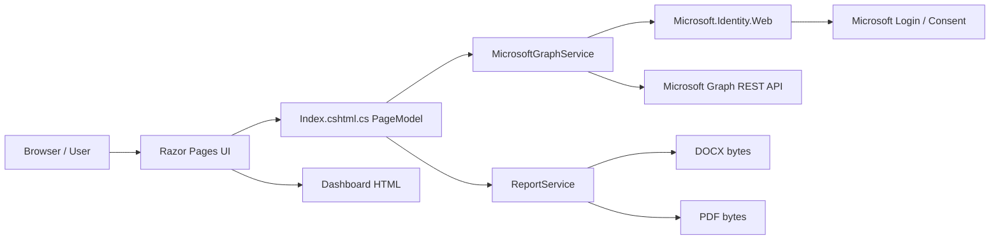
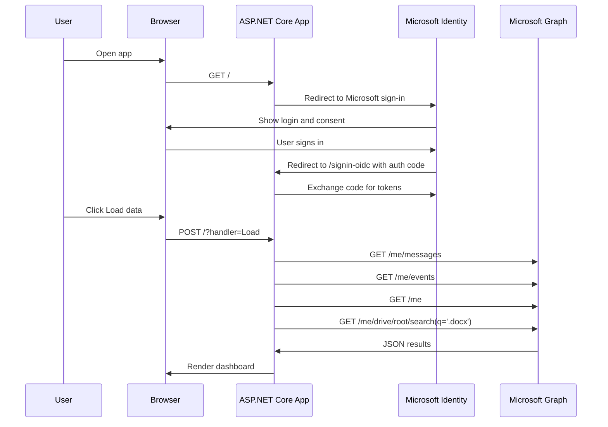

# MicrosoftPilot 从零开始开发指南

版本：1.1 终稿  
适用项目：ASP.NET Core Razor Pages + Microsoft Identity + Microsoft Graph + Azure App Service  
目标读者：有 C# 基础、正在学习 Web App、Microsoft Graph、Azure 发布流程的学生  

> 本教材使用一个真实可运行的教学项目作为主线：用户使用个人 Microsoft 账号登录，应用只读访问 Outlook 邮件、Calendar meeting、账号资料、OneDrive 中最近修改的 Word 文档，并生成 DOCX/PDF 报告。项目不修改用户数据，不保存用户邮件内容，不把 Client Secret 写入源代码。

---

## 目录

1. 项目目标
2. 最终功能清单
3. 系统架构总览
4. 开发环境准备
5. 从零创建 Visual Studio Solution
6. 安装 NuGet 包
7. Azure / Entra App Registration
8. 本地配置 User Secrets
9. 项目配置文件 appsettings.json
10. Program.cs 后端启动流程
11. 数据模型 Models
12. Microsoft Graph 后端服务
13. Razor Page 后端 PageModel
14. Razor 前端页面
15. Microsoft 风格 UI 设计
16. DOCX/PDF 报告生成
17. 本地运行和调试
18. Azure Linux Web App 发布
19. Linux 友好 ZIP 打包脚本
20. 常见错误和排查
21. 课堂教学建议
22. 官方参考资料

---

## 1. 项目目标

这个项目不是一个商业级 Microsoft 365 管理系统，而是一个教学用 Web App 样例。它的价值在于把学生最容易混乱的几个概念串起来：

- ASP.NET Core Razor Pages 如何组织前端和后端
- Microsoft 账号登录为什么需要 App Registration
- Client ID 和 Client Secret 分别是什么
- Microsoft Graph 权限为什么必须在 Azure Portal 配置
- 本地 localhost 和线上 Azure App Service 为什么需要不同 redirect URI
- 为什么密钥不能 hard code 在代码里
- 如何把 Graph 返回的 JSON 转换成页面上的数据
- 如何把页面数据导出为 DOCX/PDF 报告
- 如何发布到 Azure Linux Web App

本项目遵循一个原则：

> 所有 Microsoft Graph 操作都是 read-only。应用只读取用户授权的数据，不创建、不修改、不删除用户数据。

---

## 2. 最终功能清单

最终应用包含这些功能：

| 功能 | 数据来源 | Graph 权限 | 是否修改数据 |
|---|---|---|---|
| Microsoft 个人账号登录 | Microsoft Identity Platform | openid, profile | 否 |
| 读取今天 Outlook 邮件 | `/me/messages` | `Mail.Read` | 否 |
| 显示 urgent/high importance 邮件 | `/me/messages` | `Mail.Read` | 否 |
| 显示今天所有邮件 | `/me/messages` | `Mail.Read` | 否 |
| 读取 scheduled meetings | `/me/events` | `Calendars.Read` | 否 |
| 过滤航班、酒店、包裹等普通 calendar event | 本地 C# LINQ | `Calendars.Read` | 否 |
| 读取账号 profile | `/me` | `User.Read` | 否 |
| 读取最近修改的 Word 文档 metadata | `/me/drive/root/search(q='.docx')` | `Files.Read` | 否 |
| 生成 DOCX 报告 | 本地 OpenXML | 无额外权限 | 否 |
| 生成 PDF 报告 | 本地 QuestPDF | 无额外权限 | 否 |
| 发布到 Azure Linux Web App | Azure App Service | 无 Graph 权限 | 否 |

注意：个人 Microsoft 账号不支持用 Microsoft Graph delegated API 读取 Teams chat 列表。因此最终版本删除了 chat 功能，避免学生误以为代码错了。

---

## 3. 系统架构总览

### 3.1 组件关系



### 3.2 登录和读取数据流程



### 3.3 为什么 Web App 需要 Client Secret

这个项目是 server-side Web App。登录时，浏览器先跳到 Microsoft 登录页，登录成功后 Microsoft 把授权码发回服务器。服务器再用：

- Client ID
- Client Secret
- Redirect URI
- Authorization Code

去换 access token。

Client Secret 用来证明“这个服务器确实是这个 App Registration 的拥有者”。它不属于普通用户，不需要每个用户本地都有一份。真正部署后，只有服务器环境变量里保存 secret。

---

## 4. 开发环境准备

推荐环境：

- Windows 11
- Visual Studio Community 2026
- ASP.NET and web development workload
- Azure and AI development workload
- .NET 10 SDK
- 一个个人 Microsoft 账号，例如 Outlook.com
- 一个可用的 Azure subscription，用于发布 Azure Web App

命令行检查：

```powershell
dotnet --info
```

如果项目目标框架是 `net10.0`，Azure Web App runtime 也应选择 `.NET 10`。

---

## 5. 从零创建 Visual Studio Solution

### 5.1 创建项目文件夹

本项目使用：

```powershell
E:\microsoftpilot
```

从零开始时可以执行：

```powershell
mkdir E:\microsoftpilot
cd E:\microsoftpilot
```

### 5.2 用 dotnet CLI 创建 Razor Pages 项目

```powershell
dotnet new webapp -n MicrosoftPilot -f net10.0
```

如果你希望项目文件直接放在 `E:\microsoftpilot` 根目录，可以这样：

```powershell
cd E:\microsoftpilot
dotnet new webapp -n MicrosoftPilot -f net10.0 -o .
```

### 5.3 创建 Solution

```powershell
dotnet new sln -n MicrosoftPilot
dotnet sln add MicrosoftPilot.csproj
```

Visual Studio 也可以直接打开：

```text
E:\microsoftpilot\MicrosoftPilot.csproj
```

或者打开 solution：

```text
E:\microsoftpilot\MicrosoftPilot.sln
```

本项目当前使用 `.slnx` 也可以被新版 Visual Studio 打开。

教学提醒：不同版本 Visual Studio 可能生成 `.sln` 或 `.slnx`。这不是项目逻辑差异，只是 solution 文件格式不同。学生只要能在 Visual Studio 中看到 `MicrosoftPilot` 项目，并且项目能 build，就可以继续。

---

## 6. 安装 NuGet 包

项目需要这些包：

```powershell
dotnet add package Microsoft.Identity.Web --version 4.*
dotnet add package Microsoft.Identity.Web.UI --version 4.*
dotnet add package DocumentFormat.OpenXml --version 3.*
dotnet add package QuestPDF --version 2025.*
```

最终 `MicrosoftPilot.csproj` 核心内容如下：

```xml
<Project Sdk="Microsoft.NET.Sdk.Web">

  <PropertyGroup>
    <TargetFramework>net10.0</TargetFramework>
    <Nullable>enable</Nullable>
    <ImplicitUsings>enable</ImplicitUsings>
    <UserSecretsId>29d70735-9250-4393-8c2e-be12fcbc965f</UserSecretsId>
  </PropertyGroup>

  <ItemGroup>
    <PackageReference Include="DocumentFormat.OpenXml" Version="3.*" />
    <PackageReference Include="Microsoft.Identity.Web" Version="4.*" />
    <PackageReference Include="Microsoft.Identity.Web.UI" Version="4.*" />
    <PackageReference Include="QuestPDF" Version="2025.*" />
  </ItemGroup>

</Project>
```

解释：

- `Microsoft.NET.Sdk.Web` 表示这是 ASP.NET Core Web 项目。
- `net10.0` 表示使用 .NET 10。
- `Nullable` 开启 C# nullable reference type，减少空引用错误。
- `ImplicitUsings` 自动引入常用命名空间。
- `UserSecretsId` 用于本地保存敏感配置，不把 secret 写进代码。这个值由 `dotnet user-secrets init` 生成，每台机器、每个项目都可以不同；学生不需要复制教材中的示例 ID。
- `Microsoft.Identity.Web` 封装 OpenID Connect 和 token 获取。
- `Microsoft.Identity.Web.UI` 提供登录/登出页面和 controller route。
- `DocumentFormat.OpenXml` 用于生成 DOCX。
- `QuestPDF` 用于生成 PDF。

---

## 7. Azure / Entra App Registration

### 7.1 为什么必须注册 App

学生常见误解是：“我只是做一个简单 Web App，为什么还要注册 App？”

原因是：Microsoft 登录和 Graph API 都需要知道是哪一个应用在请求用户授权。App Registration 的作用是建立一份信任记录：

- 这个应用的名字是什么
- 它的 Client ID 是什么
- 它允许哪些登录账号类型
- 登录后可以跳回哪些 redirect URI
- 它请求哪些 Graph 权限
- 它是否有 server-side secret

没有 App Registration，Microsoft Identity Platform 不知道应该把用户登录结果发回哪里，也不知道这个应用是否被允许请求 Graph 数据。

### 7.2 创建 App Registration

进入 Azure Portal：

```text
Microsoft Entra ID
App registrations
New registration
```

推荐设置：

| 项目 | 设置 |
|---|---|
| Name | MicrosoftPilot 或教学项目名 |
| Supported account types | Personal Microsoft accounts 或 Accounts in any organizational directory and personal Microsoft accounts |
| Redirect URI platform | Web |
| Redirect URI local | `https://localhost:5001/signin-oidc` |

详细操作步骤：

1. 打开浏览器进入 Azure Portal：`https://portal.azure.com`。
2. 确认右上角登录的是你准备用来开发和注册应用的 Microsoft 账号。
3. 在页面顶部搜索框输入 `Microsoft Entra ID`。
4. 点击搜索结果中的 `Microsoft Entra ID`。
5. 进入 Entra 页面后，在左侧菜单找到 `Manage` 分组。
6. 点击 `App registrations`。
7. 点击页面顶部的 `New registration`。
8. 在 `Name` 中输入应用名称，例如 `MicrosoftPilot`。应用名称不需要和 Visual Studio 项目名完全一样，但教学时建议保持一致，方便排查。
9. 在 `Supported account types` 中选择支持个人 Microsoft 账号的选项。只面向 Outlook.com/Hotmail/Live 个人账号时，可以选择 personal Microsoft accounts；如果希望学校或公司账号也能登录，可以选择同时支持组织账号和个人账号的选项。
10. 在 `Redirect URI` 区域，平台选择 `Web`。
11. 输入本地回调地址，例如 `https://localhost:5001/signin-oidc`。
12. 点击 `Register`。
13. 注册完成后会进入应用 Overview 页面。复制 `Application (client) ID`，这就是代码配置里的 `AzureAd:ClientId`。
14. 同一页还能看到 `Directory (tenant) ID`。本项目面向个人账号时使用 `TenantId=consumers`，通常不需要把这个 tenant GUID 放进代码。

如果你的本地端口不是 5001，就按实际端口配置。例如：

```text
https://localhost:7123/signin-oidc
```

### 7.3 线上 Redirect URI

发布到 Azure 后，还要在同一个 App Registration 里增加线上地址：

```text
https://你的站点.azurewebsites.net/signin-oidc
```

本项目线上示例格式：

```text
https://microsoftpilot-xxxxx.australiaeast-01.azurewebsites.net/signin-oidc
```

重点：

> redirect_uri 必须完全匹配。协议、域名、端口、路径都要一致。

下面这些都不是同一个 URI：

```text
https://localhost:5001/signin-oidc
http://localhost:5001/signin-oidc
https://localhost:5002/signin-oidc
https://localhost:5001/signin-oidc/
```

添加线上 redirect URI 的详细步骤：

1. Azure Portal 顶部搜索 `App registrations`。
2. 打开你的应用，例如 `MicrosoftPilot`。
3. 左侧菜单点击 `Authentication`。
4. 如果还没有 Web platform，点击 `Add a platform`，选择 `Web`。
5. 如果已经有 Web platform，在 `Web` 区域点击 `Add URI`。
6. 输入线上地址：`https://你的站点.azurewebsites.net/signin-oidc`。
7. 点击页面顶部或底部的 `Save`。
8. 保存后重新打开线上网站并再次登录。

如果出现 `invalid_request: redirect_uri is not valid`，不要先改代码。先复制浏览器地址栏里的 `redirect_uri=` 参数，URL decode 后和 App Registration 中保存的 URI 做逐字符比较。绝大多数问题是少了 `/signin-oidc`、协议写成了 `http`、端口不同，或线上域名复制错。

### 7.4 创建 Client Secret

路径：

```text
App registrations
你的应用
Certificates & secrets
Client secrets
New client secret
```

创建后会显示两个值：

| 字段 | 用途 |
|---|---|
| Secret ID | Azure 内部识别这个 secret 的 ID，不能用于代码登录 |
| Value | 真正要放进应用配置的 secret，只显示一次 |

必须复制的是 **Value**，不是 Secret ID。

详细操作步骤：

1. 打开 App Registration。
2. 左侧菜单点击 `Certificates & secrets`。
3. 进入 `Client secrets` 页签。
4. 点击 `New client secret`。
5. 在 `Description` 中写一个容易识别的名字，例如 `local-and-azure-demo`。
6. 选择过期时间。教学项目可以选较短时间；正式项目需要有 secret rotation 计划。
7. 点击 `Add`。
8. 页面会显示 `Value` 和 `Secret ID`。
9. 立即复制 `Value`。本页面关闭后通常无法再看到完整 Value。
10. 不要把 `Value` 写进 Git、截图、教材、聊天记录或公开文档。

### 7.5 API Permissions

路径：

```text
App registrations
你的应用
API permissions
Add a permission
Microsoft Graph
Delegated permissions
```

添加：

```text
User.Read
Mail.Read
Calendars.Read
Files.Read
```

详细操作步骤：

1. Azure Portal 顶部搜索 `App registrations`。
2. 打开你的应用。
3. 左侧菜单点击 `API permissions`。
4. 点击 `Add a permission`。
5. 在弹出的面板中选择 `Microsoft Graph`。
6. 选择 `Delegated permissions`。本项目必须用 Delegated permissions，因为它代表当前登录用户读取当前用户自己的数据。
7. 在搜索框输入 `User.Read`，勾选 `User.Read`。
8. 搜索 `Mail.Read`，勾选 `Mail.Read`。
9. 搜索 `Calendars.Read`，勾选 `Calendars.Read`。
10. 搜索 `Files.Read`，勾选 `Files.Read`。
11. 点击面板底部的 `Add permissions`。
12. 回到 `API permissions` 页面，确认列表中能看到这四个 delegated permissions。

个人账号应用通常不需要点击 `Grant admin consent`。如果你使用的是学校或公司 tenant，管理员可能限制用户 consent，这时需要管理员批准；这不是代码错误。

解释：

- `User.Read` 读取登录用户基本资料。
- `Mail.Read` 读取用户邮箱邮件。
- `Calendars.Read` 读取用户日历事件。
- `Files.Read` 读取用户 OneDrive 文件 metadata。

这里使用 delegated permissions，因为应用代表“当前登录用户”读取“这个用户自己的数据”。

不要使用 Application permissions。Application permissions 是无用户后台权限，通常需要管理员同意，权限更大，不适合这个教学项目。

---

## 8. 本地配置 User Secrets

### 8.1 为什么不用 appsettings.json 保存真实 key

`appsettings.json` 会进入源代码和发布包。教学项目可以公开源码，但不能公开 secret。

因此：

- `ClientId` 可以是占位符或公开示例
- `ClientSecret` 不能写进代码
- 本地开发用 User Secrets
- Azure 线上用 App Service Configuration

### 8.2 初始化 User Secrets

```powershell
cd E:\microsoftpilot
dotnet user-secrets init
```

### 8.3 设置本地配置

用你自己的 App Registration 值替换：

```powershell
dotnet user-secrets set "AzureAd:TenantId" "consumers"
dotnet user-secrets set "AzureAd:ClientId" "你的-client-id"
dotnet user-secrets set "AzureAd:ClientSecret" "你的-client-secret-value"
```

检查：

```powershell
dotnet user-secrets list
```

注意：课堂演示时不要把 `ClientSecret` 投屏给学生。它是服务器密码。

---

## 9. 项目配置文件 appsettings.json

项目中的 `appsettings.json` 保存非敏感默认配置：

```json
{
  "AzureAd": {
    "Instance": "https://login.microsoftonline.com/",
    "Domain": "",
    "TenantId": "consumers",
    "ClientId": "YOUR_CLIENT_ID",
    "ClientSecret": "",
    "CallbackPath": "/signin-oidc"
  },
  "Graph": {
    "StartupScopes": [
      "User.Read",
      "Mail.Read",
      "Calendars.Read",
      "Files.Read"
    ],
    "MailScopes": [ "Mail.Read" ],
    "CalendarScopes": [ "Calendars.Read" ],
    "FileScopes": [ "Files.Read" ],
    "ProfileScopes": [ "User.Read" ],
    "ChatScopes": []
  },
  "Logging": {
    "LogLevel": {
      "Default": "Information",
      "Microsoft.AspNetCore": "Warning"
    }
  },
  "AllowedHosts": "*"
}
```

关键解释：

- `Instance` 是 Microsoft 登录服务根地址。
- `TenantId=consumers` 表示只面向个人 Microsoft 账号。
- `CallbackPath=/signin-oidc` 是 Microsoft 登录完成后的回调路径。
- `StartupScopes` 是登录后应用希望取得的 Graph 权限。
- 分开的 `MailScopes`、`CalendarScopes`、`FileScopes`、`ProfileScopes` 让代码更清楚。
- `ChatScopes` 留空，因为个人账号不能通过 Graph delegated API 读取 recent chats。

配置读取优先级通常是：

```text
appsettings.json
appsettings.Development.json
User Secrets
Environment Variables
Command Line
```

所以本地 User Secrets 可以覆盖 `appsettings.json` 里的占位值；Azure 环境变量也可以覆盖发布包里的占位值。

---

## 10. Program.cs 后端启动流程

`Program.cs` 是 ASP.NET Core 应用的入口。它做三件事：

1. 注册服务
2. 配置中间件 pipeline
3. 映射页面和 route

核心代码：

```csharp
using Microsoft.AspNetCore.Authentication.OpenIdConnect;
using Microsoft.Identity.Web;
using Microsoft.Identity.Web.UI;
using MicrosoftPilot.Services;
using QuestPDF.Infrastructure;

var builder = WebApplication.CreateBuilder(args);

var graphScopes = builder.Configuration.GetSection("Graph:StartupScopes").Get<string[]>()
                  ?? Array.Empty<string>();

builder.Services
    .AddAuthentication(OpenIdConnectDefaults.AuthenticationScheme)
    .AddMicrosoftIdentityWebApp(builder.Configuration.GetSection("AzureAd"))
    .EnableTokenAcquisitionToCallDownstreamApi(graphScopes)
    .AddInMemoryTokenCaches();
```

逐句解释：

- `AddAuthentication(OpenIdConnectDefaults.AuthenticationScheme)` 告诉 ASP.NET Core 使用 OpenID Connect 登录。
- `AddMicrosoftIdentityWebApp(...)` 读取 `AzureAd` 配置，接入 Microsoft Identity。
- `EnableTokenAcquisitionToCallDownstreamApi(graphScopes)` 允许后端代表用户获取 Graph access token。
- `AddInMemoryTokenCaches()` 把 token 临时存在服务器内存中。教学项目简单清楚；商业项目应考虑分布式缓存。

授权配置：

```csharp
builder.Services.AddAuthorization(options =>
{
    options.FallbackPolicy = options.DefaultPolicy;
});
```

含义：

> 默认所有 Razor Page 都必须登录，除非页面明确标记为 AllowAnonymous。

注册 MVC/Razor/服务：

```csharp
builder.Services.AddControllersWithViews().AddMicrosoftIdentityUI();
builder.Services.AddRazorPages();
builder.Services.AddHttpClient<MicrosoftGraphService>();
builder.Services.AddScoped<ReportService>();
```

解释：

- `AddMicrosoftIdentityUI()` 提供 `/MicrosoftIdentity/Account/SignIn` 等登录相关 route。
- `AddRazorPages()` 启用 Razor Pages。
- `AddHttpClient<MicrosoftGraphService>()` 给 Graph service 注入安全的 HttpClient。
- `AddScoped<ReportService>()` 每次请求创建一个报告服务实例。

QuestPDF license：

```csharp
QuestPDF.Settings.License = LicenseType.Community;
```

QuestPDF 要求明确选择 license。教学小项目通常可使用 Community，但商业使用必须查看 QuestPDF 许可条款。

HTTP pipeline：

```csharp
var app = builder.Build();

if (!app.Environment.IsDevelopment())
{
    app.UseExceptionHandler("/Error");
    app.UseHsts();
}

app.UseHttpsRedirection();
app.UseRouting();
app.UseAuthentication();
app.UseAuthorization();

app.MapStaticAssets();
app.MapControllers();
app.MapGet("/health", () => Results.Ok("OK")).AllowAnonymous();
app.MapRazorPages().WithStaticAssets();

app.Run();
```

顺序很重要：

- `UseRouting()` 先识别请求要去哪里。
- `UseAuthentication()` 先识别当前用户是谁。
- `UseAuthorization()` 再判断这个用户是否允许访问。
- `MapControllers()` 让 Microsoft Identity UI 的 controller route 生效。
- `/health` 允许匿名访问，用于 Azure 健康检查。

---

## 11. 数据模型 Models

模型文件是 `Models/DashboardModels.cs`。它定义页面和报告共享的数据结构。

邮件模型：

```csharp
public sealed record MailSummary(
    string Subject,
    string From,
    DateTimeOffset ReceivedAt,
    bool IsRead,
    string Importance,
    string? WebLink);
```

解释：

- `record` 适合表达只读数据。
- `Subject` 邮件标题。
- `From` 发件人显示名。
- `ReceivedAt` 收件时间。
- `IsRead` 是否已读。
- `Importance` 邮件重要性，可能是 `high`、`normal`、`low`。
- `WebLink` Outlook 网页链接。

会议模型：

```csharp
public sealed record MeetingSummary(
    string Subject,
    string Organizer,
    DateTimeOffset Start,
    DateTimeOffset End,
    string Location,
    bool IsOnlineMeeting,
    string? WebLink);
```

注意：Graph `/me/events` 返回的是 calendar events，不一定都是 meeting。因此后端需要过滤掉航班、酒店、包裹提醒等事件。

Word 文档模型：

```csharp
public sealed record WordDocumentSummary(
    string Name,
    DateTimeOffset LastModifiedAt,
    string? WebUrl,
    long? Size);
```

汇总模型：

```csharp
public sealed class DashboardReport
{
    public DateTimeOffset GeneratedAt { get; init; } = DateTimeOffset.Now;
    public IReadOnlyList<MailSummary> Messages { get; init; } = Array.Empty<MailSummary>();
    public IReadOnlyList<MeetingSummary> Meetings { get; init; } = Array.Empty<MeetingSummary>();
    public CommunitySummary? Community { get; init; }
    public IReadOnlyList<WordDocumentSummary> WordDocuments { get; init; } = Array.Empty<WordDocumentSummary>();
    public IReadOnlyList<string> Errors { get; init; } = Array.Empty<string>();

    public int UnreadCount => Messages.Count(message => !message.IsRead);

    public int HighImportanceCount => Messages.Count(message =>
        string.Equals(message.Importance, "high", StringComparison.OrdinalIgnoreCase));

    public int NormalImportanceCount => Messages.Count(message =>
        string.Equals(message.Importance, "normal", StringComparison.OrdinalIgnoreCase));
}
```

解释：

- `DashboardReport` 是页面和报告服务之间的“数据合同”。
- 前端不直接调用 Graph，只读取 `DashboardReport`。
- 报告生成也不直接调用 Graph，只读取 `DashboardReport`。
- 这样可以保持分层清楚。

---

## 12. Microsoft Graph 后端服务

核心文件是 `Services/MicrosoftGraphService.cs`。

### 12.1 服务职责

这个类负责：

- 获取用户 access token
- 构造 Graph REST URL
- 发送 GET 请求
- 解析 JSON
- 转换成 C# 模型
- 处理分页
- 处理权限错误

它不负责：

- HTML 页面渲染
- 按钮点击
- DOCX/PDF 排版
- 保存数据库

### 12.2 注入依赖

```csharp
public sealed class MicrosoftGraphService(
    HttpClient httpClient,
    ITokenAcquisition tokenAcquisition,
    IConfiguration configuration)
{
    private const string GraphRoot = "https://graph.microsoft.com/v1.0";
}
```

解释：

- `HttpClient` 用于发送 Graph API 请求。
- `ITokenAcquisition` 来自 Microsoft.Identity.Web，用于获取当前登录用户的 access token。
- `IConfiguration` 用于读取 scopes。
- `GraphRoot` 是 Graph v1.0 API 根地址。

### 12.3 Scope 分组

```csharp
private string[] MailScopes => GetScopes("Graph:MailScopes", ["Mail.Read"]);
private string[] CalendarScopes => GetScopes("Graph:CalendarScopes", ["Calendars.Read"]);
private string[] FileScopes => GetScopes("Graph:FileScopes", ["Files.Read"]);
private string[] ProfileScopes => GetScopes("Graph:ProfileScopes", ["User.Read"]);
```

这样写的好处：

- 邮件 API 只请求邮件权限。
- 日历 API 只请求日历权限。
- 文件 API 只请求文件权限。
- 以后改权限不用改很多硬编码。

### 12.4 读取今天 Outlook 邮件

```csharp
public async Task<IReadOnlyList<MailSummary>> GetTodaysMessagesAsync(CancellationToken cancellationToken)
{
    var localStart = new DateTimeOffset(DateTime.Today);
    var localEnd = localStart.AddDays(1);
    var utcStart = localStart.ToUniversalTime().ToString("yyyy-MM-ddTHH:mm:ssZ");
    var utcEnd = localEnd.ToUniversalTime().ToString("yyyy-MM-ddTHH:mm:ssZ");

    var filter = $"receivedDateTime ge {utcStart} and receivedDateTime lt {utcEnd}";
    var url = $"{GraphRoot}/me/messages" +
              "?$select=subject,from,receivedDateTime,isRead,importance,webLink" +
              "&$orderby=receivedDateTime desc" +
              "&$top=50" +
              $"&$filter={Uri.EscapeDataString(filter)}";

    var values = await GetPagedValuesAsync(url, MailScopes, cancellationToken);

    return values.Select(item =>
    {
        var from = item.GetPropertyOrNull("from")?
            .GetPropertyOrNull("emailAddress")?
            .GetStringOrDefault("name") ?? "Unknown sender";

        return new MailSummary(
            Subject: item.GetStringOrDefault("subject", "(no subject)") ?? "(no subject)",
            From: from,
            ReceivedAt: item.GetDateTimeOffsetOrDefault("receivedDateTime"),
            IsRead: item.GetBoolOrDefault("isRead"),
            Importance: item.GetStringOrDefault("importance", "normal") ?? "normal",
            WebLink: item.GetStringOrDefault("webLink", null));
    }).ToList();
}
```

教学重点：

- Graph 时间通常用 UTC，代码先算本地今天，再转换成 UTC 过滤区间。
- `$select` 只取需要的字段，减少网络传输。
- `$orderby=receivedDateTime desc` 让最新邮件排在前面。
- `$top=50` 限制返回数量，避免教学项目一次读太多。
- `Uri.EscapeDataString(filter)` 避免 filter 中的空格和符号破坏 URL。
- JSON 解析后转换成 `MailSummary`，前端不需要知道 Graph JSON 结构。

### 12.5 读取 scheduled meetings

```csharp
public async Task<IReadOnlyList<MeetingSummary>> GetScheduledMeetingsAsync(CancellationToken cancellationToken)
{
    var url = $"{GraphRoot}/me/events" +
              "?$select=subject,organizer,start,end,location,isOnlineMeeting,webLink" +
              "&$top=50";

    var values = await GetPagedValuesAsync(url, CalendarScopes, cancellationToken);

    return values.Select(item =>
        {
            var organizer = item.GetPropertyOrNull("organizer")?
                .GetPropertyOrNull("emailAddress")?
                .GetStringOrDefault("name") ?? "Unknown organizer";

            var location = item.GetPropertyOrNull("location")?
                .GetStringOrDefault("displayName", "") ?? "";

            return new MeetingSummary(
                Subject: item.GetStringOrDefault("subject", "(no subject)") ?? "(no subject)",
                Organizer: organizer,
                Start: item.GetGraphDateTimeOrDefault("start"),
                End: item.GetGraphDateTimeOrDefault("end"),
                Location: string.IsNullOrWhiteSpace(location) ? "No location" : location,
                IsOnlineMeeting: item.GetBoolOrDefault("isOnlineMeeting"),
                WebLink: item.GetStringOrDefault("webLink", null));
        })
        .Where(meeting =>
            meeting.IsOnlineMeeting ||
            meeting.Location.Contains("Teams", StringComparison.OrdinalIgnoreCase) ||
            meeting.Location.Contains("Meeting", StringComparison.OrdinalIgnoreCase) ||
            meeting.Subject.Contains("meeting", StringComparison.OrdinalIgnoreCase))
        .ToList();
}
```

教学重点：

- `/me/events` 返回 calendar events，不保证每一项都是会议。
- Outlook 可能从邮件自动生成航班、酒店、包裹提醒等事件。
- 所以这里本地过滤，只显示 meeting-like events。
- 过滤条件保持简单，方便学生理解：
  - 是 online meeting
  - 地点包含 Teams
  - 地点包含 Meeting
  - 标题包含 meeting

### 12.6 读取账号资料

```csharp
public async Task<CommunitySummary> GetCommunityAsync(CancellationToken cancellationToken)
{
    var root = await GetObjectAsync(
        $"{GraphRoot}/me?$select=displayName,mail,userPrincipalName,preferredLanguage",
        ProfileScopes,
        cancellationToken);

    return new CommunitySummary(
        DisplayName: root.GetStringOrDefault("displayName", "Unknown user") ?? "Unknown user",
        Mail: root.GetStringOrDefault("mail", "") ?? "",
        UserPrincipalName: root.GetStringOrDefault("userPrincipalName", "") ?? "",
        PreferredLanguage: root.GetStringOrDefault("preferredLanguage", "") ?? "");
}
```

对于个人 Microsoft 账号，很多组织字段不存在。教学项目只显示 Graph 能稳定返回的 profile 字段。

### 12.7 读取最近 Word 文档

```csharp
public async Task<IReadOnlyList<WordDocumentSummary>> GetRecentWordDocumentsAsync(CancellationToken cancellationToken)
{
    var values = await GetPagedValuesAsync(
        $"{GraphRoot}/me/drive/root/search(q='.docx')?$select=name,lastModifiedDateTime,webUrl,size,file&$top=25",
        FileScopes,
        cancellationToken,
        pageLimit: 1);

    return values
        .Where(item => item.GetStringOrDefault("name", "")?.EndsWith(".docx", StringComparison.OrdinalIgnoreCase) == true)
        .OrderByDescending(item => item.GetDateTimeOffsetOrDefault("lastModifiedDateTime"))
        .Take(5)
        .Select(item => new WordDocumentSummary(
            Name: item.GetStringOrDefault("name", "Unnamed document") ?? "Unnamed document",
            LastModifiedAt: item.GetDateTimeOffsetOrDefault("lastModifiedDateTime"),
            WebUrl: item.GetStringOrDefault("webUrl", null),
            Size: item.GetLongOrNull("size")))
        .ToList();
}
```

教学重点：

- 只读取 metadata，不下载文档内容。
- 先搜索 `.docx`，再用 C# 过滤文件名。
- 按 `lastModifiedDateTime` 降序排列。
- 只取前 5 个，页面简洁。

### 12.8 汇总报告数据

```csharp
public async Task<DashboardReport> BuildReportAsync(CancellationToken cancellationToken)
{
    var errors = new List<string>();
    IReadOnlyList<MailSummary> messages = Array.Empty<MailSummary>();
    IReadOnlyList<MeetingSummary> meetings = Array.Empty<MeetingSummary>();
    IReadOnlyList<WordDocumentSummary> wordDocuments = Array.Empty<WordDocumentSummary>();
    CommunitySummary? community = null;

    try { messages = await GetTodaysMessagesAsync(cancellationToken); }
    catch (Exception ex) when (!IsConsentChallenge(ex)) { errors.Add($"Outlook mail could not be loaded: {ex.Message}"); }

    try { meetings = await GetScheduledMeetingsAsync(cancellationToken); }
    catch (Exception ex) when (!IsConsentChallenge(ex)) { errors.Add($"Scheduled meetings could not be loaded: {ex.Message}"); }

    try { community = await GetCommunityAsync(cancellationToken); }
    catch (Exception ex) when (!IsConsentChallenge(ex)) { errors.Add($"Account/community profile could not be loaded: {ex.Message}"); }

    try { wordDocuments = await GetRecentWordDocumentsAsync(cancellationToken); }
    catch (Exception ex) when (!IsConsentChallenge(ex)) { errors.Add($"Recent Word documents could not be loaded: {ex.Message}"); }

    return new DashboardReport
    {
        GeneratedAt = DateTimeOffset.Now,
        Messages = messages,
        Meetings = meetings,
        Community = community,
        WordDocuments = wordDocuments,
        Errors = errors
    };
}
```

为什么每个模块单独 try/catch？

如果 Word 文档权限有问题，不应该导致邮件也无法显示。这样页面可以显示部分数据，并在 warning panel 中告诉用户哪一块失败。

但 consent challenge 不能被吞掉：

```csharp
private static bool IsConsentChallenge(Exception exception)
{
    return exception.GetType().Name == "MicrosoftIdentityWebChallengeUserException" ||
           exception.Message.Contains("IDW10502", StringComparison.OrdinalIgnoreCase);
}
```

如果用户还没有同意新权限，应用应跳转到 Microsoft consent 页面，而不是把它当普通错误显示。

### 12.9 发送 Graph GET 请求

```csharp
private async Task<HttpResponseMessage> SendGraphGetAsync(
    string url,
    string[] scopes,
    CancellationToken cancellationToken)
{
    var accessToken = await tokenAcquisition.GetAccessTokenForUserAsync(scopes);
    using var request = new HttpRequestMessage(HttpMethod.Get, url);
    request.Headers.Authorization = new AuthenticationHeaderValue("Bearer", accessToken);
    request.Headers.Accept.Add(new MediaTypeWithQualityHeaderValue("application/json"));

    var response = await httpClient.SendAsync(request, cancellationToken);

    if (response.StatusCode is HttpStatusCode.Forbidden or HttpStatusCode.Unauthorized)
    {
        response.Dispose();
        throw new InvalidOperationException(
            "Microsoft Graph rejected the request. Check app permissions and user consent.");
    }

    response.EnsureSuccessStatusCode();
    return response;
}
```

这里体现 OAuth 的核心：

- Web App 本身没有用户数据。
- 用户登录并同意后，应用拿到 access token。
- 每次调用 Graph 时，把 token 放到 `Authorization: Bearer ...` header。
- Graph 根据 token 判断这个用户、这个应用、这些权限是否允许访问。

---

## 13. Razor Page 后端 PageModel

文件：`Pages/Index.cshtml.cs`

### 13.1 类定义

```csharp
[AuthorizeForScopes(ScopeKeySection = "Graph:StartupScopes")]
public class IndexModel(MicrosoftGraphService graphService, ReportService reportService) : PageModel
{
    public DashboardReport? Report { get; private set; }

    public void OnGet()
    {
    }
}
```

解释：

- `[AuthorizeForScopes]` 是 Microsoft.Identity.Web 提供的 attribute。
- 它知道页面需要哪些 Graph scopes。
- 如果 token 缺少权限，它可以触发 consent challenge。
- `Report` 是页面要显示的数据。
- 初次打开页面时 `Report` 为 null。

### 13.2 Load data 按钮

```csharp
public async Task<IActionResult> OnPostLoadAsync(CancellationToken cancellationToken)
{
    try
    {
        Report = await graphService.BuildReportAsync(cancellationToken);
        return Page();
    }
    catch (MicrosoftIdentityWebChallengeUserException)
    {
        return ConsentChallenge();
    }
}
```

Razor Pages 命名约定：

- 页面上按钮 `asp-page-handler="Load"`
- 后端方法名 `OnPostLoadAsync`

点击按钮后：

```text
Browser POST /?handler=Load
ASP.NET Core calls OnPostLoadAsync
GraphService reads data
Page renders dashboard
```

### 13.3 下载 DOCX

```csharp
public async Task<IActionResult> OnPostDownloadDocxAsync(CancellationToken cancellationToken)
{
    DashboardReport report;

    try
    {
        report = await graphService.BuildReportAsync(cancellationToken);
    }
    catch (MicrosoftIdentityWebChallengeUserException)
    {
        return ConsentChallenge();
    }

    var bytes = reportService.CreateDocx(report);
    var fileName = $"microsoft-pilot-report-{DateTime.Now:yyyyMMdd-HHmm}.docx";

    return File(bytes, "application/vnd.openxmlformats-officedocument.wordprocessingml.document", fileName);
}
```

重点：

- 下载报告时重新读取最新数据。
- `CreateDocx` 返回 byte array。
- `File(...)` 告诉浏览器下载文件。
- MIME type 使用 Word 文档的标准类型。

### 13.4 下载 PDF

```csharp
public async Task<IActionResult> OnPostDownloadPdfAsync(CancellationToken cancellationToken)
{
    DashboardReport report;

    try
    {
        report = await graphService.BuildReportAsync(cancellationToken);
    }
    catch (MicrosoftIdentityWebChallengeUserException)
    {
        return ConsentChallenge();
    }

    var bytes = reportService.CreatePdf(report);
    var fileName = $"microsoft-pilot-report-{DateTime.Now:yyyyMMdd-HHmm}.pdf";

    return File(bytes, "application/pdf", fileName);
}
```

### 13.5 强制 consent

```csharp
private ChallengeResult ConsentChallenge()
{
    var properties = new AuthenticationProperties
    {
        RedirectUri = Url.Page("/Index")
    };

    properties.SetParameter("prompt", "consent");

    return Challenge(properties, OpenIdConnectDefaults.AuthenticationScheme);
}
```

为什么要 `prompt=consent`？

当我们在 Azure Portal 新增 Graph 权限后，用户旧 token 可能没有这些权限。强制 consent 可以让用户重新看到授权页面，避免一直出现 `IDW10502`。

---

## 14. Razor 前端页面

文件：`Pages/Index.cshtml`

### 14.1 页面开头

```cshtml
@page
@model IndexModel
@{
    ViewData["Title"] = "Microsoft Account Pilot";
    var urgentMessages = Model.Report?.Messages
        .Where(message => string.Equals(message.Importance, "high", StringComparison.OrdinalIgnoreCase))
        .ToList() ?? [];
    var recentMessages = Model.Report?.Messages
        .OrderByDescending(message => message.ReceivedAt)
        .ToList() ?? [];
}
```

解释：

- `@page` 表示这是 Razor Page。
- `@model IndexModel` 连接到 `Index.cshtml.cs`。
- `urgentMessages` 在页面层根据 `Importance=high` 过滤。
- `recentMessages` 按时间倒序显示当天所有邮件。

### 14.2 顶部操作区

```cshtml
<section class="app-shell">
    <div class="hero-band">
        <div>
            <p class="eyebrow">Personal Microsoft account sample</p>
            <h1>Outlook, calendar, profile, and Word report</h1>
            <p class="hero-copy">Sign in with a Microsoft account, read Microsoft Graph data without modifying anything, then export a DOCX report.</p>
        </div>
        <form method="post" class="hero-actions">
            <button class="ms-button primary" type="submit" asp-page-handler="Load">
                <span aria-hidden="true">R</span>
                Load data
            </button>
            <button class="ms-button" type="submit" asp-page-handler="DownloadDocx">
                <span aria-hidden="true">W</span>
                DOCX
            </button>
            <button class="ms-button" type="submit" asp-page-handler="DownloadPdf">
                <span aria-hidden="true">P</span>
                PDF
            </button>
        </form>
    </div>
</section>
```

教学重点：

- 三个按钮共用一个 `<form method="post">`。
- `asp-page-handler="Load"` 对应 `OnPostLoadAsync`。
- `asp-page-handler="DownloadDocx"` 对应 `OnPostDownloadDocxAsync`。
- `asp-page-handler="DownloadPdf"` 对应 `OnPostDownloadPdfAsync`。

### 14.3 空状态

```cshtml
@if (Model.Report is null)
{
    <div class="empty-state">
        <h2>Ready to read Microsoft Graph</h2>
        <p>Click <strong>Load data</strong>. The app reads Outlook mail, calendar meetings, account profile, and recent Word document metadata.</p>
    </div>
}
```

用户刚打开页面还没有点击 Load data，所以 `Report` 是 null。空状态告诉用户下一步要做什么。

### 14.4 指标卡片

```cshtml
<section class="metric-grid" aria-label="Daily summary">
    <div class="metric-tile">
        <span>Urgent mail</span>
        <strong>@Model.Report.HighImportanceCount</strong>
    </div>
    <div class="metric-tile">
        <span>All mail</span>
        <strong>@Model.Report.Messages.Count</strong>
    </div>
    <div class="metric-tile">
        <span>Meetings</span>
        <strong>@Model.Report.Meetings.Count</strong>
    </div>
    <div class="metric-tile">
        <span>Word docs</span>
        <strong>@Model.Report.WordDocuments.Count</strong>
    </div>
</section>
```

指标卡片适合显示摘要数字，让用户先获得全局概览。

### 14.5 Urgent 邮件列表

```cshtml
@foreach (var message in urgentMessages)
{
    <article class="mail-row urgent">
        <div>
            <a href="@message.WebLink" target="_blank" rel="noopener">@message.Subject</a>
            <p>@message.From</p>
        </div>
        <span>@message.ReceivedAt.ToLocalTime().ToString("HH:mm")</span>
    </article>
}
```

解释：

- `mail-row urgent` 会显示红色左边框。
- `target="_blank"` 在新窗口打开 Outlook。
- `rel="noopener"` 是安全习惯，避免新窗口反向控制原页面。
- `ToLocalTime()` 把 Graph 时间转换成本地时间显示。

### 14.6 所有邮件列表

```cshtml
@foreach (var message in recentMessages)
{
    <article class="mail-row @(string.Equals(message.Importance, "high", StringComparison.OrdinalIgnoreCase) ? "urgent" : "")">
        <div>
            <a href="@message.WebLink" target="_blank" rel="noopener">@message.Subject</a>
            <p>@message.From - @message.Importance</p>
        </div>
        <span>@message.ReceivedAt.ToLocalTime().ToString("HH:mm")</span>
    </article>
}
```

这里显示今天所有邮件，并在发件人后面显示 importance，例如 `normal`、`high`。

### 14.7 Scheduled meetings 列表

```cshtml
@foreach (var meeting in Model.Report.Meetings)
{
    <article class="mail-row">
        <div>
            <a href="@meeting.WebLink" target="_blank" rel="noopener">@meeting.Subject</a>
            <p>@meeting.Organizer - @meeting.Location</p>
        </div>
        <span>@meeting.Start.ToLocalTime().ToString("MMM d HH:mm")</span>
    </article>
}
```

注意：列表只显示后端过滤后的 meeting-like events。航班、酒店、包裹提醒会被后端过滤掉。

### 14.8 最近 Word 文档

```cshtml
@foreach (var document in Model.Report.WordDocuments)
{
    <article class="mail-row">
        <div>
            <a href="@document.WebUrl" target="_blank" rel="noopener">@document.Name</a>
            <p>Modified @document.LastModifiedAt.ToLocalTime().ToString("yyyy-MM-dd HH:mm")</p>
        </div>
        <span>@(document.Size is null ? "" : $"{document.Size.Value / 1024d:0.0} KB")</span>
    </article>
}
```

这部分只显示文件 metadata，不读取 Word 文档正文。

---

## 15. Microsoft 风格 UI 设计

文件：`wwwroot/css/site.css`

设计目标是“像一个标准微软应用”，而不是做花哨 landing page。核心特点：

- 使用 Segoe UI 字体
- 白色面板
- 浅灰背景
- Microsoft 蓝色 `#0f6cbd`
- 8px 圆角
- 简洁卡片
- 左边框表示列表项状态
- urgent 邮件用红色强调

核心 CSS：

```css
body {
  background: #f5f7fb;
  color: #1f2937;
  font-family: "Segoe UI", system-ui, -apple-system, BlinkMacSystemFont, sans-serif;
  margin-bottom: 72px;
}

a {
  color: #0f6cbd;
}

.brand-mark {
  background: conic-gradient(from 90deg, #f25022 0 25%, #7fba00 0 50%, #00a4ef 0 75%, #ffb900 0);
  display: inline-block;
  height: 20px;
  width: 20px;
}
```

按钮：

```css
.ms-button {
  align-items: center;
  background: #ffffff;
  border: 1px solid #c7cdd8;
  border-radius: 6px;
  color: #111827;
  display: inline-flex;
  font-weight: 600;
  gap: 8px;
  min-height: 40px;
  padding: 0 14px;
}

.ms-button.primary {
  background: #0f6cbd;
  border-color: #0f6cbd;
  color: #ffffff;
}
```

响应式布局：

```css
@media (max-width: 900px) {
  .hero-band,
  .content-grid {
    grid-template-columns: 1fr;
  }

  .hero-band {
    align-items: flex-start;
    display: grid;
  }

  .hero-actions {
    justify-content: flex-start;
  }

  .metric-grid {
    grid-template-columns: 1fr;
  }

  .member-row {
    grid-template-columns: 1fr;
  }
}
```

教学重点：

- 桌面端使用两列 grid。
- 手机端改为单列。
- 不依赖 JavaScript 也能工作。
- 页面重点是数据，而不是装饰。

---

## 16. DOCX/PDF 报告生成

文件：`Services/ReportService.cs`

### 16.1 服务职责

`ReportService` 接收一个 `DashboardReport`，生成：

- DOCX byte array
- PDF byte array

它不调用 Graph，不知道用户如何登录。这样职责清楚：

```text
GraphService: 负责拿数据
IndexModel: 负责处理按钮
ReportService: 负责生成文件
Razor Page: 负责显示 HTML
```

### 16.2 生成 DOCX

```csharp
public byte[] CreateDocx(DashboardReport report)
{
    using var stream = new MemoryStream();

    using (var document = WordprocessingDocument.Create(stream, WordprocessingDocumentType.Document))
    {
        var mainPart = document.AddMainDocumentPart();
        mainPart.Document = new DocumentFormat.OpenXml.Wordprocessing.Document(new Body());
        var body = mainPart.Document.Body!;

        body.Append(CreateHeading("Microsoft Account Daily Report", 32));
        body.Append(CreateParagraph($"Generated: {report.GeneratedAt:yyyy-MM-dd HH:mm}"));
        body.Append(CreateParagraph($"Unread mail: {report.UnreadCount}"));
        body.Append(CreateParagraph($"Urgent mail: {report.HighImportanceCount}"));
        body.Append(CreateParagraph($"Mid importance mail: {report.NormalImportanceCount}"));
        body.Append(CreateParagraph($"Scheduled meetings: {report.Meetings.Count}"));
        body.Append(CreateParagraph($"Recent Word documents: {report.WordDocuments.Count}"));

        AddErrors(body, report);
        AddCommunitySection(body, report.Community);
        AddMailSection(body, report.Messages);
        AddMeetingsSection(body, report.Meetings);
        AddWordDocumentsSection(body, report.WordDocuments);

        mainPart.Document.Save();
    }

    return stream.ToArray();
}
```

解释：

- `MemoryStream` 在内存中生成文件，不需要先写磁盘。
- `WordprocessingDocument.Create` 创建 DOCX 文件结构。
- `MainDocumentPart` 是 Word 主文档部分。
- `Body` 是 Word 文档正文。
- 最后 `stream.ToArray()` 返回文件 bytes 给浏览器下载。

### 16.3 创建标题和段落

```csharp
private static Paragraph CreateHeading(string text, int fontSize)
{
    return new Paragraph(
        new Run(
            new RunProperties(
                new Bold(),
                new FontSize { Val = fontSize.ToString() },
                new DocumentFormat.OpenXml.Wordprocessing.Color { Val = "2563EB" }),
            new Text(text)));
}
```

OpenXML 的结构是：

```text
Paragraph
  Run
    RunProperties
    Text
```

也就是说：

- Paragraph 表示一段。
- Run 表示一段中的一段连续文字。
- RunProperties 控制加粗、字号、颜色。
- Text 是真正的文本内容。

普通段落：

```csharp
private static Paragraph CreateParagraph(string text, bool bold = false)
{
    var runProperties = bold ? new RunProperties(new Bold()) : new RunProperties();

    return new Paragraph(new Run(runProperties, new Text(text)
    {
        Space = SpaceProcessingModeValues.Preserve
    }));
}
```

`SpaceProcessingModeValues.Preserve` 用于保留文本中的空格。

### 16.4 生成 PDF

```csharp
public byte[] CreatePdf(DashboardReport report)
{
    var document = QuestPDF.Fluent.Document.Create(container =>
    {
        container.Page(page =>
        {
            page.Margin(36);
            page.Size(PageSizes.A4);
            page.DefaultTextStyle(text => text.FontSize(10).FontFamily("Segoe UI"));

            page.Header()
                .Text("Microsoft Account Daily Report")
                .FontSize(22)
                .SemiBold()
                .FontColor(Colors.Blue.Medium);

            page.Content().Column(column =>
            {
                column.Spacing(10);
                column.Item().Text($"Generated: {report.GeneratedAt:yyyy-MM-dd HH:mm}");
                column.Item().Text($"Unread mail: {report.UnreadCount}    Urgent mail: {report.HighImportanceCount}    Mid mail: {report.NormalImportanceCount}    Meetings: {report.Meetings.Count}    Word docs: {report.WordDocuments.Count}");
            });
        });
    });

    return document.GeneratePdf();
}
```

QuestPDF 使用 fluent API：

- `Page` 定义页面。
- `Header` 定义页眉。
- `Content` 定义正文。
- `Footer` 定义页脚。
- `Column` 表示垂直排列。

---

## 17. 本地运行和调试

### 17.1 检查 User Secrets

```powershell
cd E:\microsoftpilot
dotnet user-secrets list
```

应包含：

```text
AzureAd:TenantId = consumers
AzureAd:ClientId = 你的-client-id
AzureAd:ClientSecret = 你的-secret-value
```

### 17.2 确认 redirect URI

Azure Portal 中必须有：

```text
https://localhost:5001/signin-oidc
```

如果 Visual Studio 实际使用其他端口，就添加实际端口。

### 17.3 命令行运行

```powershell
cd E:\microsoftpilot
dotnet run
```

### 17.4 Visual Studio 运行

1. 打开 `MicrosoftPilot.csproj` 或 solution。
2. 选择 `https` profile。
3. 按 F5。
4. 浏览器打开 localhost。
5. 点击 Load data。
6. 登录 Microsoft 账号并 consent。

### 17.5 调试 Graph 返回

如果某一块数据为空，先判断：

- 用户账号里是否真的有数据
- 权限是否添加
- 用户是否 consent
- App Registration 是否支持 personal accounts
- Redirect URI 是否完全匹配

---

## 18. Azure Linux Web App 发布

### 18.1 创建 Azure Web App

Azure Portal 入口：

```text
Create a resource
Web App
```

推荐设置：

| 项目 | 设置 |
|---|---|
| Publish | Code |
| Runtime stack | .NET 10 |
| Operating System | Linux |
| Region | Australia East 或就近区域 |
| Pricing plan | Free F1 可用于教学实验 |

如果 Windows Free 不允许创建，选择 Linux Free 是可以的。

详细操作步骤：

1. 打开 `https://portal.azure.com`。
2. 确认右上角登录的是拥有 Azure subscription 的账号。
3. 在左上角点击 `Create a resource`。如果左侧菜单没有显示，可以先点击左上角三横线或 Azure 图标展开菜单。
4. 在搜索框输入 `Web App`。
5. 点击搜索结果中的 `Web App`。
6. 点击 `Create`。
7. 在 `Basics` 页签中选择 subscription。
8. 选择已有 Resource group，或点击 `Create new` 新建一个，例如 `microsoftpilot-rg`。教学项目建议单独建 resource group，方便课后统一删除。
9. 在 `Name` 中输入站点名，例如 `microsoftpilot`。Azure 会生成一个默认域名，格式通常类似 `https://microsoftpilot-xxxxx.region.azurewebsites.net`。如果名称被占用，Azure 会要求换一个。
10. `Publish` 选择 `Code`。
11. `Runtime stack` 选择 `.NET 10`，必须和项目里的 `<TargetFramework>net10.0</TargetFramework>` 对应。
12. `Operating System` 选择 `Linux`。
13. `Region` 选择离学生或学校较近的区域，例如 `Australia East`。
14. `App Service Plan` 可以新建。教学实验可选 Free F1；如果 Azure 页面不允许 Windows Free，Linux Free 通常可用。
15. 点击 `Review + create`。
16. 检查摘要无误后点击 `Create`。
17. 等待部署完成，点击 `Go to resource` 进入 Web App。
18. 在 Web App 的 `Overview` 页复制 `Default domain`。后面设置 redirect URI 和访问网站都要用这个域名。

创建完成后先点击 `Overview` 页顶部的 `Browse`。如果看到 Azure 默认页面，例如 “Your web app is running and waiting for your content”，说明 Web App 资源创建成功，但你的代码还没有部署上去。

### 18.2 App Service Configuration

进入：

```text
Web App
Settings
Environment variables 或 Configuration
Application settings
```

添加：

```text
AzureAd__TenantId = consumers
AzureAd__ClientId = 你的-client-id
AzureAd__ClientSecret = 你的-client-secret-value
ASPNETCORE_ENVIRONMENT = Production
```

注意双下划线：

```text
AzureAd__ClientId
```

它会映射到：

```json
"AzureAd": {
  "ClientId": "..."
}
```

详细操作步骤：

1. 打开 Azure Portal 中的 Web App 资源。
2. 确认页面标题是你的 Web App 名称，而不是 App Registration 名称。Web App 是运行网站的地方；App Registration 是登录授权配置，二者不是同一个资源。
3. 在左侧菜单找到 `Settings` 分组。
4. 点击 `Environment variables`。有些 portal 版本仍显示为 `Configuration`，含义相同。
5. 进入 `App settings` 或 `Application settings` 区域。
6. 点击 `Add` 或 `New application setting`。
7. 添加 `AzureAd__TenantId`，值为 `consumers`。
8. 添加 `AzureAd__ClientId`，值为 App Registration Overview 页面的 `Application (client) ID`。
9. 添加 `AzureAd__ClientSecret`，值为 Client Secret 的 `Value`，不是 Secret ID。
10. 添加 `ASPNETCORE_ENVIRONMENT`，值为 `Production`。
11. 点击 `Apply` 或 `Save`。
12. Azure 通常会提示这些修改会 restart Web App，选择确认。
13. 保存后回到 `Overview`，确认 Web App 状态是 `Running`。

注意：App Service 的环境变量会覆盖发布包里的 `appsettings.json`。所以发布包可以继续保留 `YOUR_CLIENT_ID` 这种占位符，线上真正使用的是 Azure Portal 中的环境变量。

### 18.3 App Service Authentication 必须关闭

路径：

```text
Web App
Authentication
```

设置：

```text
App Service Authentication = Off
```

原因：

本项目代码里已经使用 Microsoft.Identity.Web 处理登录。如果 Azure App Service 自带 Authentication 也打开，会出现双重认证，学生更难理解，也可能导致 redirect 混乱。

详细操作步骤：

1. 打开 Web App 资源。
2. 左侧菜单点击 `Authentication`。
3. 查看页面顶部或主区域中的 `App Service authentication` 状态。
4. 如果是 `On`，点击编辑或开关，把它改成 `Off`。
5. 保存。
6. 保存后重启 Web App。

课堂解释：这里不是说 Azure 的 Authentication 功能不好，而是本项目已经在 ASP.NET Core 代码里自己处理 Microsoft 登录。教学时保留一种登录机制更清楚。

### 18.4 App Registration 增加线上 redirect URI

Azure Portal：

```text
Microsoft Entra ID
App registrations
你的应用
Authentication
Web
Redirect URIs
```

添加：

```text
https://你的站点.azurewebsites.net/signin-oidc
```

必须和浏览器地址完全一致。

详细操作步骤：

1. 先在 Web App 的 `Overview` 页复制 `Default domain`。
2. 打开 Azure Portal 顶部搜索框，搜索 `App registrations`。
3. 打开你的 App Registration。
4. 左侧菜单点击 `Authentication`。
5. 找到 `Platform configurations` 中的 `Web`。
6. 点击 `Add URI`。
7. 输入 `https://你的默认域名/signin-oidc`。例如：`https://microsoftpilot-xxxxx.australiaeast-01.azurewebsites.net/signin-oidc`。
8. 保留本地 URI `https://localhost:5001/signin-oidc`，不要删除。一个 App Registration 可以同时有本地和线上多个 redirect URI。
9. 点击 `Save`。
10. 回到线上网站重新登录测试。

检查点：如果登录页 URL 中仍然出现 `client_id=YOUR_CLIENT_ID`，说明 Azure App Service 环境变量没有生效，或者配置 key 写错了。正确 key 是 `AzureAd__ClientId`，中间是两个下划线。

---

## 19. Linux 友好 ZIP 打包脚本

文件：`publish-linux-zip.bat`

### 19.1 为什么需要这个脚本

Azure Linux App Service 使用 Linux 文件系统。ZIP 包内部路径应使用正斜杠：

```text
wwwroot/css/site.css
MicrosoftPilot.dll
```

如果 ZIP 内部使用 Windows 反斜杠：

```text
wwwroot\css\site.css
```

Kudu/rsync 部署时可能出错或解压结构不正确。

### 19.2 脚本用法

双击：

```text
E:\microsoftpilot\publish-linux-zip.bat
```

脚本会生成：

```text
E:\microsoftpilot\microsoftpilot-linux-forwardslash.zip
```

### 19.3 脚本核心代码

```bat
@echo off
setlocal

set "PROJECT_DIR=%~dp0"
set "PROJECT_FILE=%PROJECT_DIR%MicrosoftPilot.csproj"
set "PUBLISH_DIR=%TEMP%\microsoftpilot-publish-linuxzip"
set "ZIP_FILE=%PROJECT_DIR%microsoftpilot-linux-forwardslash.zip"

if exist "%PUBLISH_DIR%" rmdir /s /q "%PUBLISH_DIR%"
if exist "%ZIP_FILE%" del /f /q "%ZIP_FILE%"

dotnet publish "%PROJECT_FILE%" -c Release -o "%PUBLISH_DIR%"
if errorlevel 1 (
    echo Publish failed.
    pause
    exit /b 1
)
```

这部分负责：

- 找到项目路径。
- 清理旧 publish folder。
- 清理旧 zip。
- 执行 `dotnet publish`。

PowerShell 打包部分：

```bat
powershell -NoProfile -ExecutionPolicy Bypass -Command ^
  "$publishDir = '%PUBLISH_DIR%';" ^
  "$zip = '%ZIP_FILE%';" ^
  "Add-Type -AssemblyName System.IO.Compression;" ^
  "Add-Type -AssemblyName System.IO.Compression.FileSystem;" ^
  "$root = (Resolve-Path $publishDir).Path.TrimEnd('\') + '\';" ^
  "$archive = [System.IO.Compression.ZipFile]::Open($zip, [System.IO.Compression.ZipArchiveMode]::Create);" ^
  "try {" ^
  "  Get-ChildItem -LiteralPath $publishDir -Recurse -File | ForEach-Object {" ^
  "    $relative = $_.FullName.Substring($root.Length).Replace('\','/');" ^
  "    [System.IO.Compression.ZipFileExtensions]::CreateEntryFromFile($archive, $_.FullName, $relative, [System.IO.Compression.CompressionLevel]::Optimal) | Out-Null;" ^
  "  }" ^
  "} finally { $archive.Dispose(); }"
```

关键是：

```powershell
$relative = $_.FullName.Substring($root.Length).Replace('\','/')
```

这句把 ZIP entry name 从 Windows 路径改成 Linux 友好的正斜杠路径。

### 19.4 上传 ZIP

上传文件：

```text
E:\microsoftpilot\microsoftpilot-linux-forwardslash.zip
```

详细操作步骤：

1. 打开 Azure Portal：`https://portal.azure.com`。
2. 在顶部搜索框输入你的 Web App 名称，例如 `microsoftpilot`。
3. 点击搜索结果中的 Web App。注意资源类型应显示为 `App Service` 或 `Web App`，不是 App Registration。
4. 进入 Web App 后，在左侧菜单找到 `Deployment` 分组。
5. 点击 `Deployment Center`。
6. 页面上方通常有 `Settings`、`Containers`、`Logs`、`FTPS Credentials` 等页签。确认你在 `Settings` 页签。
7. 找到 `Source` 下拉框。
8. 打开 `Source` 下拉框，选择 `Publish files`。有些 portal 版本显示为 `Publish files (new)`。
9. 选择后页面会出现上传区域，通常有 `Select file` 按钮或文件选择框。
10. 点击 `Select file`。
11. 在文件选择窗口中找到 `E:\microsoftpilot\microsoftpilot-linux-forwardslash.zip`。
12. 选中文件并确认。
13. 回到 Deployment Center 页面后，点击 `Save`。有些 portal 版本按钮叫 `Deploy` 或保存后自动开始部署。
14. 如果页面右侧弹出通知，等待出现 `Deployment succeeded`。
15. 切换到 `Logs` 页签，确认最新 deployment 没有红色错误。
16. 回到 Web App `Overview` 页，点击 `Restart`，确保新代码启动。
17. 点击 `Browse` 打开网站。

如果你找不到 `Deployment Center`：

- 确认你打开的是 Web App 资源，不是 Resource group、App Service Plan 或 App Registration。
- 在 Web App 左侧菜单顶部的搜索框输入 `Deployment Center`。
- 也可以从 Web App `Overview` 页右侧的 deployment 区域点击相关链接进入。

如果 `Source` 下拉框里没有 `Publish files`：

- 先确认 Web App 是 Code 模式，不是 Container 模式。
- 如果已经设置过 GitHub、Azure Repos 等 CI/CD，可以先断开或更换 source。
- 对教学项目，最简单路径是 `Publish files` 手动上传 zip。

发布完成后打开：

```text
https://你的站点.azurewebsites.net
```

健康检查：

```text
https://你的站点.azurewebsites.net/health
```

如果返回：

```text
OK
```

说明 ASP.NET Core 应用进程已经启动。

---

## 20. 常见错误和排查

### 20.1 AADSTS700016: Application with identifier was not found

常见原因：

- `ClientId` 还是占位符 `YOUR_CLIENT_ID`
- 复制了错误的 App Registration
- 登录到了错误 tenant
- App Registration 不支持当前账号类型

解决：

1. 检查 User Secrets 或 Azure App Service Configuration。
2. 确认 `AzureAd:ClientId` 是 App Registration Overview 里的 Application client ID。
3. 个人账号项目建议 `TenantId=consumers`。

### 20.2 unauthorized_client: client does not exist or is not enabled for consumers

含义：

应用不支持个人 Microsoft 账号登录。

解决：

App Registration 中确认 Supported account types 包含 personal Microsoft accounts。

如果 manifest 中手动改过 `signInAudience`，应确保它支持 personal accounts。

### 20.3 invalid_request: redirect_uri is not valid

含义：

登录请求里的 redirect URI 不在 App Registration 列表中。

解决：

在 App Registration -> Authentication -> Web 中添加精确 URI。

本地：

```text
https://localhost:5001/signin-oidc
```

线上：

```text
https://你的站点.azurewebsites.net/signin-oidc
```

### 20.4 AADSTS7000215: Invalid client secret provided

常见原因：

把 Secret ID 当成 Secret Value。

解决：

重新创建 client secret，复制 **Value**，放入：

本地：

```powershell
dotnet user-secrets set "AzureAd:ClientSecret" "secret-value"
```

Azure：

```text
AzureAd__ClientSecret = secret-value
```

### 20.5 IDW10502 / ca_incremental-consent

含义：

用户当前 token 没有新权限，需要重新 consent。

解决：

- 确认 App Registration API permissions 已添加。
- 重新登录。
- 代码里使用 `AuthorizeForScopes` 和 `prompt=consent`。
- 必要时清理浏览器 cookie 或使用 InPrivate。

### 20.6 403 This web app is stopped

含义：

Azure Web App 停止了。

解决：

Web App Overview -> Start。

这不是代码 key 问题，是 App Service 进程没有运行。

### 20.7 Azure 默认页面：Your web app is running and waiting for your content

含义：

Web App 已启动，但你的应用内容没有部署成功，或部署还没覆盖默认页面。

解决：

- 等 1-5 分钟。
- 检查 Deployment Center logs。
- 确认 ZIP 根目录直接包含 `MicrosoftPilot.dll`，不是多包了一层 folder。
- 使用 `publish-linux-zip.bat` 重新打包上传。

### 20.8 Kudu rsync ExitCode 123

可能原因：

ZIP 内部路径使用 Windows 反斜杠，Linux 部署时处理失败。

解决：

使用本项目的：

```text
publish-linux-zip.bat
```

确认输出：

```text
Backslash entries: 0
Has MicrosoftPilot.dll: True
```

### 20.9 Scheduled meetings 显示航班、酒店、包裹

原因：

Outlook 会从邮件自动生成 calendar events。Graph `/me/events` 会返回这些事件。

解决：

后端过滤 meeting-like events：

```csharp
.Where(meeting =>
    meeting.IsOnlineMeeting ||
    meeting.Location.Contains("Teams", StringComparison.OrdinalIgnoreCase) ||
    meeting.Location.Contains("Meeting", StringComparison.OrdinalIgnoreCase) ||
    meeting.Subject.Contains("meeting", StringComparison.OrdinalIgnoreCase))
```

---

## 21. 课堂教学建议

### 21.1 推荐课时安排

| 课时 | 内容 |
|---|---|
| 第 1 次 | Razor Pages 基础、项目结构、运行空模板 |
| 第 2 次 | Microsoft Identity 登录、App Registration、redirect URI |
| 第 3 次 | Microsoft Graph permissions、Mail.Read、Calendars.Read |
| 第 4 次 | 后端 service、HttpClient、JSON 解析、模型转换 |
| 第 5 次 | Razor 前端展示、CSS Microsoft 风格 |
| 第 6 次 | DOCX/PDF 报告生成 |
| 第 7 次 | Azure Linux Web App 发布和故障排查 |

### 21.2 学生练习

练习 1：新增 Low importance 邮件卡片。

提示：

```csharp
public int LowImportanceCount => Messages.Count(message =>
    string.Equals(message.Importance, "low", StringComparison.OrdinalIgnoreCase));
```

练习 2：把 scheduled meetings 限制为未来 30 天。

提示：

```csharp
var now = DateTimeOffset.Now;
var end = now.AddDays(30);
```

练习 3：在 DOCX 报告中增加表格。

提示：

OpenXML 表格结构是：

```text
Table
  TableRow
    TableCell
      Paragraph
        Run
          Text
```

练习 4：把 CSS 颜色改成更接近 Fluent UI。

练习 5：添加 `/health` 的 Azure Health Check。

### 21.3 评分标准

| 项目 | 分值 |
|---|---:|
| 能成功登录个人 Microsoft 账号 | 15 |
| Graph 权限配置正确 | 15 |
| 邮件和 meeting 数据读取正确 | 20 |
| 前后端分层清楚 | 15 |
| UI 清晰且响应式 | 10 |
| DOCX 或 PDF 报告可下载 | 10 |
| Azure 发布成功 | 10 |
| 不泄漏 secret | 5 |

---

## 22. 官方参考资料

以下资料用于核对本教材中的 Microsoft Identity、Graph permission、redirect URI 和 Azure App Service 发布步骤：

- Microsoft Graph app registration: https://learn.microsoft.com/en-us/graph/auth-register-app-v2
- Register an application in Microsoft Entra ID: https://learn.microsoft.com/en-us/entra/identity-platform/quickstart-register-app
- Redirect URI restrictions: https://learn.microsoft.com/en-us/entra/identity-platform/reply-url
- OpenID Connect on Microsoft identity platform: https://learn.microsoft.com/en-us/entra/identity-platform/v2-protocols-oidc
- Microsoft Graph permissions overview: https://learn.microsoft.com/en-us/graph/permissions-overview
- Microsoft Graph permissions reference: https://learn.microsoft.com/en-us/graph/permissions-reference
- Azure App Service ZIP deploy: https://learn.microsoft.com/en-us/azure/app-service/deploy-zip
- Azure App Service Microsoft Entra authentication provider: https://learn.microsoft.com/en-us/azure/app-service/configure-authentication-provider-aad

---

## 结语

这个项目的核心教学价值不在于代码量，而在于把“登录、授权、Graph API、Razor 页面、报告生成、Azure 发布”串成一条完整的软件开发链路。

学生完成本项目后，应能回答这些问题：

- 为什么 Web App 需要 Client ID？
- 为什么 server-side Web App 需要 Client Secret？
- 为什么 redirect URI 必须完全匹配？
- 为什么不能把 secret 写进 appsettings.json？
- Delegated permission 和 Application permission 有什么区别？
- Razor Page 的 `.cshtml` 和 `.cshtml.cs` 如何配合？
- 后端服务如何把 Graph JSON 转换成页面模型？
- 为什么 Azure Linux ZIP 包最好使用正斜杠路径？

当学生能解释这些问题时，他们已经不只是“照着步骤跑通一个 demo”，而是真正理解了现代云端 Web App 开发的基础结构。
